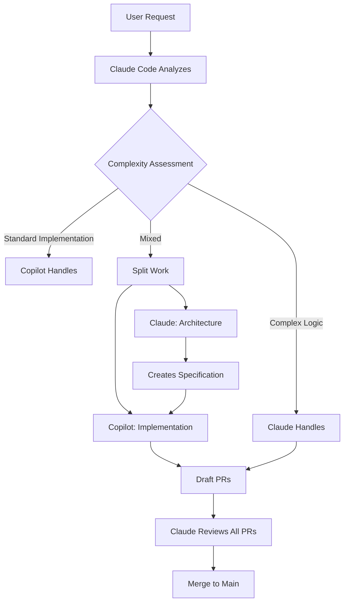

# Claude + Copilot Orchestration Strategy

## The Vision: Parallel Intelligent Development



## How They Share Context

### 1. Through GitHub Issues (Current State)
```yaml
Claude Creates Issue:
  - Detailed specifications
  - Acceptance criteria
  - Technical requirements
  ↓
Copilot Reads Issue:
  - Implements to spec
  - Follows requirements
  - Creates PR
```

### 2. Through Shared Documentation (Enhanced)
```
.github/
├── copilot-instructions.md     # Copilot's context
├── ARCHITECTURE.md              # Shared understanding
├── CURRENT-SPRINT.md           # What we're building
└── AGENT-STATUS.md             # Who's doing what
```

### 3. Through Code Comments (Future)
```javascript
// @copilot: implement the notification handler below
// Requirements: Must support WebSocket and REST
// See: #26 for full specification
class NotificationService {
  // Claude designed this interface
  // Copilot implements the methods
}
```

## Practical Orchestration Workflow

### Phase 1: Claude Plans (You Are Here)
```bash
claude /plan "Build a SaaS application"
```
Claude creates:
- Architecture documents
- Database schema
- API specifications
- Issues with clear requirements

### Phase 2: Parallel Execution (Next Step)

**Claude's Queue:**
```markdown
- Design authentication system
- Create database schema
- Define API architecture
- Security implementation
```

**Copilot's Queue:**
```markdown
- Implement user CRUD endpoints
- Create React components from specs
- Write test suites
- Build notification system ✅ (14 mins!)
- Add logging to all services
- Create admin dashboard
```

### Phase 3: Real-Time Coordination

```javascript
// In your local Claude Code session
claude> Starting work on authentication architecture
claude> Created AUTHENTICATION.md specification
claude> Creating issue #45 with implementation details
claude> Auto-assigning to Copilot for implementation
        → Copilot starts building in background
claude> Continuing with database schema design...
```

## The Magic: Shared Work Queue

Create `.github/WORK-QUEUE.yml`:
```yaml
# Auto-updated by both agents
current_sprint:
  goal: "MVP Launch"
  deadline: "2024-12-31"

claude_working_on:
  - task: "Authentication architecture"
    status: "in_progress"
    started: "2024-11-24T10:00:00Z"
    
copilot_working_on:
  - task: "Notification system"
    issue: 26
    status: "completed"
    pr: 42
  - task: "User CRUD API"
    issue: 43
    status: "in_progress"
    pr: null

ready_for_copilot:
  - issue: 44
    title: "Add pagination to all list endpoints"
    complexity: "S"
  - issue: 45
    title: "Implement rate limiting"
    complexity: "M"

ready_for_claude:
  - issue: 46
    title: "Design multi-tenant architecture"
    complexity: "XL"

completed_this_sprint:
  - issue: 26
    title: "Notification system"
    completed_by: "copilot"
    time_taken: "14 minutes"
```

## Implementation Commands

### 1. Morning Standup Command
```bash
#!/bin/bash
# .github/scripts/morning-standup.sh

echo "🚀 Development Status"
echo "===================="

echo "\n📋 Claude's Work:"
gh issue list --assignee @me --state open

echo "\n🤖 Copilot's Work:"
gh issue list --assignee copilot --state open

echo "\n✅ Completed Today:"
gh issue list --state closed --search "closed:>=$(date -d 'today' --iso-8601)"

echo "\n🔄 Active PRs:"
gh pr list --draft

echo "\n📊 Ready for Assignment:"
gh issue list --label "ready-for-copilot" --no-assignee
```

### 2. Auto-Assignment Script
```javascript
// .github/scripts/auto-orchestrate.js
const { execSync } = require('child_process');

function assessComplexity(issue) {
  const title = issue.title.toLowerCase();
  const body = issue.body.toLowerCase();
  
  // Simple tasks for Copilot
  if (title.includes('crud') || 
      title.includes('test') ||
      title.includes('fix') ||
      title.includes('add endpoint') ||
      body.includes('boilerplate')) {
    return 'copilot';
  }
  
  // Complex tasks for Claude
  if (title.includes('design') ||
      title.includes('architect') ||
      title.includes('security') ||
      title.includes('optimize') ||
      body.includes('complex')) {
    return 'claude';
  }
  
  return 'needs-review';
}

// Get unassigned issues
const issues = JSON.parse(
  execSync('gh issue list --json number,title,body,assignees --no-assignee').toString()
);

issues.forEach(issue => {
  const assignTo = assessComplexity(issue);
  
  if (assignTo === 'copilot') {
    console.log(`🤖 Assigning #${issue.number} to Copilot: ${issue.title}`);
    execSync(`gh issue edit ${issue.number} --add-assignee copilot --add-label "copilot-assigned"`);
  } else if (assignTo === 'claude') {
    console.log(`🧠 Marking #${issue.number} for Claude: ${issue.title}`);
    execSync(`gh issue edit ${issue.number} --add-label "claude-assigned"`);
  }
});
```

## The Breakthrough: Copilot Knows Your Codebase!

The `.github/copilot-instructions.md` file means Copilot:
- ✅ Knows your architecture
- ✅ Follows your patterns
- ✅ Uses your tech stack
- ✅ Understands the multi-agent system
- ✅ Can reference other parts of the codebase

## Example: Building a Feature Together

```bash
# You say:
"Build user management system"

# Claude Code (locally):
1. Designs the database schema
2. Creates API specification
3. Writes AUTHENTICATION.md
4. Creates 5 issues:
   - Issue #50: Database schema (claude)
   - Issue #51: User CRUD API (copilot)
   - Issue #52: Auth middleware (claude)
   - Issue #53: React components (copilot)
   - Issue #54: Tests (copilot)

# Parallel execution:
- Claude: Working on #50, #52
- Copilot: Cranking out #51, #53, #54
- Both: Creating PRs as they complete

# 30 minutes later:
- 5 PRs ready for review
- Complete feature implemented
- Tests passing
- Documentation updated
```

## Try This Right Now:

```bash
# Create a test issue for Copilot
gh issue create \
  --title "Add user profile CRUD API" \
  --body "Create REST endpoints for user profiles:
  - GET /api/users/:id
  - PUT /api/users/:id  
  - DELETE /api/users/:id
  Follow existing patterns in the codebase." \
  --label "copilot-ready" \
  --assignee copilot

# Watch the magic happen
```

This is the future - intelligent agents working in parallel, aware of each other, building at incredible speed!