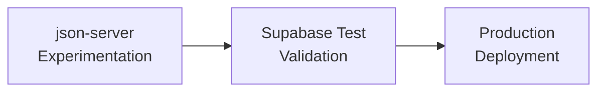

# Mock-First Development Workflow Guide

## Table of Contents
- [Overview](#overview)
- [Why Mock-First Development](#why-mock-first-development)
- [The Three-Stage Approach](#the-three-stage-approach)
- [Stage 1: Rapid Prototyping with json-server](#stage-1-rapid-prototyping-with-json-server)
- [Stage 2: Test Database with Supabase](#stage-2-test-database-with-supabase)
- [Stage 3: Production Implementation](#stage-3-production-implementation)
- [Tools Comparison](#tools-comparison)
- [Practical Examples](#practical-examples)
- [Migration Strategies](#migration-strategies)
- [Best Practices](#best-practices)

## Overview

Mock-first development is a parallel workflow that allows frontend and backend teams to work simultaneously by agreeing on API contracts upfront and using mock servers during development.

### Traditional vs Mock-First Timeline

**Traditional Sequential Development (4-6 weeks):**
```
Week 1-2: Backend Development
Week 3-4: Frontend Development  
Week 5-6: Integration & Bug Fixes
```

**Mock-First Parallel Development (2-3 weeks):**
```
Day 1:    API Contract Agreement
Day 2-14: Frontend (with mocks) || Backend (real implementation)
Day 15:   Integration & Testing
```

## Why Mock-First Development

### Benefits
1. **Parallel Development** - No team blocks another
2. **Early Issue Detection** - Find API design problems before implementation
3. **Faster Iteration** - Change mock responses instantly
4. **Better Testing** - Predictable data for automated tests
5. **Risk Reduction** - Validate UX before backend investment
6. **Clear Communication** - API contract serves as documentation

### When to Use
- New feature development
- API redesigns
- Team onboarding
- Proof of concepts
- Client demos

## The Three-Stage Approach



### Stage Progression Criteria

| Stage | Duration | Move to Next When |
|-------|----------|------------------|
| json-server | 1-2 weeks | API structure stabilized |
| Supabase Test | 1-2 weeks | Data model validated |
| Production | Ongoing | Ready for real users |

## Stage 1: Rapid Prototyping with json-server

### Installation & Setup

```bash
# Install json-server globally
npm install -g json-server

# Or use without installation
npx json-server --watch db.json
```

### Basic Configuration

**db.json:**
```json
{
  "users": [
    {
      "id": 1,
      "email": "john@example.com",
      "name": "John Doe",
      "role": "admin",
      "createdAt": "2024-01-15T10:00:00Z"
    },
    {
      "id": 2,
      "email": "jane@example.com",
      "name": "Jane Smith",
      "role": "user",
      "createdAt": "2024-01-16T14:30:00Z"
    }
  ],
  "posts": [
    {
      "id": 1,
      "userId": 1,
      "title": "Getting Started with Mock-First Development",
      "content": "This approach changes everything...",
      "published": true,
      "tags": ["development", "api", "mock"]
    }
  ],
  "comments": [
    {
      "id": 1,
      "postId": 1,
      "userId": 2,
      "text": "Great article!",
      "createdAt": "2024-01-17T09:15:00Z"
    }
  ]
}
```

### Advanced Configuration

**json-server.json:**
```json
{
  "port": 3001,
  "host": "localhost",
  "watch": true,
  "delay": 500,
  "quiet": false,
  "routes": "routes.json",
  "middlewares": ["./middleware.js"],
  "static": "./public"
}
```

**routes.json (Custom Routes):**
```json
{
  "/api/v1/*": "/$1",
  "/users/:id/posts": "/posts?userId=:id",
  "/featured/posts": "/posts?featured=true"
}
```

### Available Endpoints

```bash
# CRUD Operations
GET    /users          # List all users
GET    /users/1        # Get specific user
POST   /users          # Create user
PUT    /users/1        # Update entire user
PATCH  /users/1        # Update partial user
DELETE /users/1        # Delete user

# Filtering
GET /users?role=admin
GET /users?name=John

# Pagination
GET /users?_page=2&_limit=10

# Sorting
GET /users?_sort=name&_order=asc
GET /users?_sort=createdAt,name&_order=desc,asc

# Full-text Search
GET /users?q=john

# Relationships
GET /users/1/posts      # Get user's posts
GET /posts?_embed=comments  # Posts with comments
GET /posts?_expand=user     # Posts with user details

# Operators
GET /posts?views_gte=100    # Greater than or equal
GET /posts?views_lte=200    # Less than or equal
GET /posts?views_ne=0       # Not equal
GET /posts?tags_like=dev    # Pattern matching
```

### Frontend Integration Example

```javascript
// config.js
const API_CONFIG = {
  // Toggle between mock and production
  USE_MOCK: process.env.NODE_ENV === 'development',
  MOCK_URL: 'http://localhost:3001',
  PROD_URL: 'https://api.production.com'
};

const API_BASE = API_CONFIG.USE_MOCK 
  ? API_CONFIG.MOCK_URL 
  : API_CONFIG.PROD_URL;

// userService.js
class UserService {
  async getUsers(page = 1, limit = 10) {
    const response = await fetch(
      `${API_BASE}/users?_page=${page}&_limit=${limit}`
    );
    return response.json();
  }

  async createUser(userData) {
    const response = await fetch(`${API_BASE}/users`, {
      method: 'POST',
      headers: { 'Content-Type': 'application/json' },
      body: JSON.stringify(userData)
    });
    return response.json();
  }

  async updateUser(id, updates) {
    const response = await fetch(`${API_BASE}/users/${id}`, {
      method: 'PATCH',
      headers: { 'Content-Type': 'application/json' },
      body: JSON.stringify(updates)
    });
    return response.json();
  }
}
```

### Custom Middleware

**middleware.js:**
```javascript
module.exports = (req, res, next) => {
  // Add delay to simulate network latency
  setTimeout(next, Math.random() * 1000);
  
  // Add custom headers
  res.header('X-Api-Version', '1.0.0');
  
  // Simulate authentication
  if (req.path.startsWith('/admin') && !req.headers.authorization) {
    res.status(401).json({ error: 'Unauthorized' });
    return;
  }
  
  // Log requests
  console.log(`${req.method} ${req.path}`);
  
  next();
};
```

## Stage 2: Test Database with Supabase

### Setup Supabase Project

```bash
# Install Supabase CLI
npm install -g supabase

# Initialize project
supabase init

# Start local development
supabase start

# Create migration
supabase migration new create_users_table
```

### Schema Migration from json-server

**Original json-server structure:**
```json
{
  "users": [{"id": 1, "name": "John", "email": "john@example.com"}]
}
```

**Supabase migration:**
```sql
-- migrations/001_create_users_table.sql
CREATE TABLE users (
  id BIGSERIAL PRIMARY KEY,
  name TEXT NOT NULL,
  email TEXT UNIQUE NOT NULL,
  role TEXT DEFAULT 'user',
  created_at TIMESTAMPTZ DEFAULT NOW(),
  updated_at TIMESTAMPTZ DEFAULT NOW()
);

-- Enable RLS
ALTER TABLE users ENABLE ROW LEVEL SECURITY;

-- Create updated_at trigger
CREATE OR REPLACE FUNCTION update_updated_at()
RETURNS TRIGGER AS $$
BEGIN
  NEW.updated_at = NOW();
  RETURN NEW;
END;
$$ LANGUAGE plpgsql;

CREATE TRIGGER users_updated_at
  BEFORE UPDATE ON users
  FOR EACH ROW
  EXECUTE FUNCTION update_updated_at();

-- Insert test data
INSERT INTO users (name, email, role) VALUES
  ('John Doe', 'john@example.com', 'admin'),
  ('Jane Smith', 'jane@example.com', 'user');
```

### Supabase Client Setup

```javascript
// supabaseClient.js
import { createClient } from '@supabase/supabase-js';

const supabase = createClient(
  process.env.SUPABASE_URL,
  process.env.SUPABASE_ANON_KEY
);

// userService.js - Supabase version
class UserService {
  async getUsers(page = 1, limit = 10) {
    const start = (page - 1) * limit;
    const end = start + limit - 1;
    
    const { data, error, count } = await supabase
      .from('users')
      .select('*', { count: 'exact' })
      .range(start, end)
      .order('created_at', { ascending: false });
    
    if (error) throw error;
    return { data, total: count };
  }

  async createUser(userData) {
    const { data, error } = await supabase
      .from('users')
      .insert(userData)
      .select()
      .single();
    
    if (error) throw error;
    return data;
  }

  async updateUser(id, updates) {
    const { data, error } = await supabase
      .from('users')
      .update(updates)
      .eq('id', id)
      .select()
      .single();
    
    if (error) throw error;
    return data;
  }
}
```

### Adding Relationships

```sql
-- Create related tables
CREATE TABLE posts (
  id BIGSERIAL PRIMARY KEY,
  user_id BIGINT REFERENCES users(id) ON DELETE CASCADE,
  title TEXT NOT NULL,
  content TEXT,
  published BOOLEAN DEFAULT false,
  created_at TIMESTAMPTZ DEFAULT NOW()
);

CREATE TABLE comments (
  id BIGSERIAL PRIMARY KEY,
  post_id BIGINT REFERENCES posts(id) ON DELETE CASCADE,
  user_id BIGINT REFERENCES users(id) ON DELETE CASCADE,
  text TEXT NOT NULL,
  created_at TIMESTAMPTZ DEFAULT NOW()
);

-- Create views for common queries
CREATE VIEW posts_with_author AS
SELECT 
  p.*,
  u.name as author_name,
  u.email as author_email
FROM posts p
JOIN users u ON p.user_id = u.id;
```

## Stage 3: Production Implementation

### Production Checklist

#### Database
- [ ] Add proper indexes
- [ ] Set up RLS policies
- [ ] Configure backups
- [ ] Set up monitoring
- [ ] Add data validation constraints

#### API
- [ ] Implement rate limiting
- [ ] Add request validation
- [ ] Set up error tracking
- [ ] Configure caching
- [ ] Add API versioning

#### Security
- [ ] Enable authentication
- [ ] Set up authorization rules
- [ ] Add input sanitization
- [ ] Configure CORS properly
- [ ] Implement audit logging

### Production Schema

```sql
-- Production-ready users table
CREATE TABLE users (
  id UUID DEFAULT gen_random_uuid() PRIMARY KEY,
  email TEXT UNIQUE NOT NULL CHECK (email ~* '^[A-Za-z0-9._%+-]+@[A-Za-z0-9.-]+\.[A-Z|a-z]{2,}$'),
  name TEXT NOT NULL CHECK (char_length(name) >= 2),
  role TEXT NOT NULL DEFAULT 'user' CHECK (role IN ('user', 'admin', 'moderator')),
  avatar_url TEXT,
  email_verified BOOLEAN DEFAULT false,
  last_login TIMESTAMPTZ,
  created_at TIMESTAMPTZ DEFAULT NOW(),
  updated_at TIMESTAMPTZ DEFAULT NOW()
);

-- Indexes for performance
CREATE INDEX idx_users_email ON users(email);
CREATE INDEX idx_users_role ON users(role) WHERE role != 'user';
CREATE INDEX idx_users_created_at ON users(created_at DESC);

-- RLS Policies
CREATE POLICY "Users can view own profile"
  ON users FOR SELECT
  USING (auth.uid() = id);

CREATE POLICY "Users can update own profile"
  ON users FOR UPDATE
  USING (auth.uid() = id)
  WITH CHECK (auth.uid() = id AND role = 'user');

CREATE POLICY "Admins can view all users"
  ON users FOR SELECT
  USING (
    EXISTS (
      SELECT 1 FROM users
      WHERE id = auth.uid() AND role = 'admin'
    )
  );
```

## Tools Comparison

| Feature | json-server | Supabase Test | Production API |
|---------|------------|---------------|----------------|
| **Setup Time** | 30 seconds | 5 minutes | Hours/Days |
| **Data Persistence** | File-based | PostgreSQL | PostgreSQL/MySQL |
| **Authentication** | None | Built-in | Full implementation |
| **Relationships** | Fake (IDs only) | Real foreign keys | Complex joins |
| **Performance** | Instant (local) | Network latency | Optimized |
| **Scalability** | Single user | Small team | Unlimited |
| **Cost** | Free | Free tier | Infrastructure costs |
| **Schema Changes** | Edit JSON | Migrations | Migrations + downtime |
| **Best For** | Prototyping | Validation | Real users |

## Practical Examples

### E-Commerce API Development

#### Week 1: json-server prototype
```json
{
  "products": [
    {"id": 1, "name": "T-Shirt", "price": 29.99}
  ],
  "cart": [
    {"userId": 1, "items": [{"productId": 1, "quantity": 2}]}
  ]
}
```

#### Week 2: Refined structure
```json
{
  "products": [
    {
      "id": 1,
      "name": "T-Shirt",
      "basePrice": 29.99,
      "variants": [
        {"size": "S", "color": "blue", "sku": "TS-S-BL", "stock": 10},
        {"size": "M", "color": "blue", "sku": "TS-M-BL", "stock": 15}
      ]
    }
  ]
}
```

#### Week 3: Supabase test
```sql
CREATE TABLE products (
  id SERIAL PRIMARY KEY,
  name TEXT NOT NULL,
  base_price DECIMAL(10,2) NOT NULL
);

CREATE TABLE product_variants (
  id SERIAL PRIMARY KEY,
  product_id INT REFERENCES products(id),
  size VARCHAR(10),
  color VARCHAR(20),
  sku VARCHAR(50) UNIQUE,
  stock INT DEFAULT 0,
  price_adjustment DECIMAL(10,2) DEFAULT 0
);
```

#### Week 4: Production-ready
```sql
-- Add constraints, indexes, audit tables
ALTER TABLE products 
  ADD COLUMN status VARCHAR(20) DEFAULT 'draft',
  ADD COLUMN metadata JSONB DEFAULT '{}',
  ADD CONSTRAINT valid_price CHECK (base_price > 0);

CREATE INDEX idx_products_status ON products(status);
CREATE INDEX idx_variants_sku ON product_variants(sku);
CREATE INDEX idx_variants_stock ON product_variants(stock) WHERE stock < 10;
```

## Migration Strategies

### From json-server to Supabase

#### Step 1: Export json-server data
```javascript
// export-to-sql.js
const fs = require('fs');
const db = require('./db.json');

let sql = '';

// Convert users
db.users.forEach(user => {
  sql += `INSERT INTO users (id, name, email) VALUES (${user.id}, '${user.name}', '${user.email}');\n`;
});

// Convert posts
db.posts.forEach(post => {
  sql += `INSERT INTO posts (id, user_id, title, content) VALUES (${post.id}, ${post.userId}, '${post.title}', '${post.content}');\n`;
});

fs.writeFileSync('import.sql', sql);
```

#### Step 2: Import to Supabase
```bash
# Import the data
supabase db push < import.sql

# Reset sequences
psql $DATABASE_URL -c "SELECT setval('users_id_seq', (SELECT MAX(id) FROM users));"
```

### Service Layer Abstraction

```javascript
// apiService.js - Works with both json-server and Supabase
class ApiService {
  constructor(config) {
    this.mode = config.mode; // 'mock' or 'supabase'
    this.mockUrl = config.mockUrl;
    this.supabase = config.supabaseClient;
  }

  async getUsers() {
    if (this.mode === 'mock') {
      const res = await fetch(`${this.mockUrl}/users`);
      return res.json();
    } else {
      const { data } = await this.supabase
        .from('users')
        .select('*');
      return data;
    }
  }

  async createUser(userData) {
    if (this.mode === 'mock') {
      const res = await fetch(`${this.mockUrl}/users`, {
        method: 'POST',
        headers: { 'Content-Type': 'application/json' },
        body: JSON.stringify(userData)
      });
      return res.json();
    } else {
      const { data } = await this.supabase
        .from('users')
        .insert(userData)
        .select()
        .single();
      return data;
    }
  }
}

// Usage
const api = new ApiService({
  mode: process.env.API_MODE || 'mock',
  mockUrl: 'http://localhost:3001',
  supabaseClient: supabase
});
```

## Best Practices

### Do's
✅ **Start with json-server** for rapid prototyping
✅ **Define clear API contracts** before implementation
✅ **Use environment variables** for API URLs
✅ **Create abstraction layers** for easy switching
✅ **Version your mock data** in git
✅ **Test error scenarios** with mock responses
✅ **Document API changes** as you iterate

### Don'ts
❌ **Don't over-engineer** the mock structure
❌ **Don't skip the mock phase** for complex features
❌ **Don't use production data** in mocks
❌ **Don't hardcode** API URLs
❌ **Don't delay migration** once structure is stable
❌ **Don't mix** mock and real data sources

### Mock Data Best Practices

```javascript
// Good: Realistic, varied test data
{
  "users": [
    {"id": 1, "name": "Alice Johnson", "email": "alice@example.com", "status": "active"},
    {"id": 2, "name": "Bob Smith", "email": "bob@example.com", "status": "pending"},
    {"id": 3, "name": "Charlie Brown", "email": "charlie@example.com", "status": "inactive"}
  ]
}

// Bad: Lazy test data
{
  "users": [
    {"id": 1, "name": "test1", "email": "test1@test.com"},
    {"id": 2, "name": "test2", "email": "test2@test.com"}
  ]
}
```

### Error Testing with json-server

```javascript
// middleware.js - Simulate errors
module.exports = (req, res, next) => {
  // Simulate 10% error rate for testing
  if (Math.random() < 0.1) {
    res.status(500).json({ error: 'Internal Server Error' });
    return;
  }
  
  // Simulate slow network (20% of requests)
  if (Math.random() < 0.2) {
    setTimeout(next, 3000);
    return;
  }
  
  next();
};
```

## Commands Reference

### json-server Commands
```bash
# Basic usage
json-server db.json

# Custom port
json-server --port 3004 db.json

# Watch for changes
json-server --watch db.json

# Custom routes
json-server db.json --routes routes.json

# With delay
json-server --delay 1000 db.json

# Read only mode
json-server --read-only db.json

# Snapshots (save DB state)
json-server db.json --snapshots ./snapshots

# Custom ID
json-server --id _id db.json
```

### Supabase Commands
```bash
# Project management
supabase init
supabase start
supabase stop
supabase status

# Database
supabase db push
supabase db reset
supabase db dump -f backup.sql

# Migrations
supabase migration new <name>
supabase migration list
supabase migration up

# Generate types
supabase gen types typescript --local > types.ts
```

## Troubleshooting

### Common Issues

**json-server not updating:**
- Ensure `--watch` flag is used
- Check file permissions
- Restart server after structural changes

**CORS errors:**
```javascript
// Add to middleware.js
res.header('Access-Control-Allow-Origin', '*');
res.header('Access-Control-Allow-Methods', 'GET,PUT,POST,DELETE,OPTIONS');
```

**Supabase connection issues:**
- Verify environment variables
- Check RLS policies
- Ensure anon key has proper permissions

## Resources

- [json-server GitHub](https://github.com/typicode/json-server)
- [json-server Documentation](https://github.com/typicode/json-server#readme)
- [Supabase Documentation](https://supabase.com/docs)
- [Postman Mock Servers](https://learning.postman.com/docs/designing-and-developing-your-api/mocking-data/setting-up-mock/)
- [API Design Best Practices](https://swagger.io/resources/articles/best-practices-in-api-design/)

## Conclusion

The mock-first workflow accelerates development by enabling parallel work streams and early validation. Start with json-server for maximum flexibility, migrate to Supabase for realistic testing, and finally deploy to production with confidence.

Remember: **The best API is one that's been tested and refined before a single line of backend code is written.**