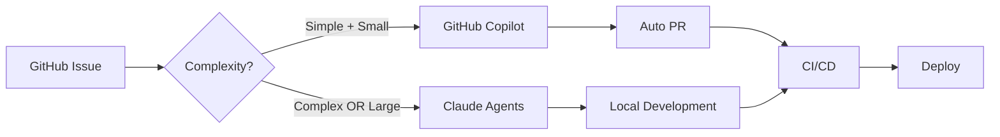

# 🚀 Multi-Agent Development Framework

<div align="center">


**Build software 10x faster with AI agents working in perfect harmony**

[Quick Start](#-quick-start) • [How It Works](#-how-it-works) • [Agents](#-meet-your-team) • [Documentation](#-documentation)

</div>

---

## 🎯 What Makes This Different?

This is a **Claude Code CLI-driven development framework** that orchestrates:

- **⚡ Claude Code CLI** - Central command interface for all development tasks
- **📝 Custom Commands** - 8 slash commands for project setup, feature creation, deployment
- **🔄 Hooks** - 3 automated hooks (current-work, auto-commit, test-before-push)
- **🤖 7 Specialized Agents** - Expert agents working through Claude's Task tool
- **🔌 MCP Servers** - Tool integrations (GitHub, Playwright, Supabase, Postman)
- **📊 GitHub Automations** - Issues, PRs, Actions, Project boards all automated

### The Magic Formula

```
GitHub Issue → Smart Routing → AI Agents → Automated Testing → Deploy
```

**Simple tasks** (Complexity 1-2, Size XS-S) → GitHub Copilot handles entirely in GitHub  
**Complex tasks** → Claude Code agents work with you locally using MCP tools

---

## ⚡ Quick Start

### 1️⃣ Clone & Initialize

```bash
# Get the template
git clone https://github.com/vanman2024/multi-agent-claude-code.git my-project
cd my-project

# Make it yours
rm -rf .git && git init
git add . && git commit -m "Initial commit from template"

# Connect to your GitHub repo
git remote add origin https://github.com/YOU/your-repo.git
git push -u origin main
```

### 2️⃣ Install Essential CLIs

```bash
# Required CLI tools
brew install gh doctl                 # GitHub & DigitalOcean  
npm install -g newman vercel          # Postman & Vercel
npx playwright install                # Browser automation
```

### 3️⃣ Add MCP Servers (Automated Setup)

```bash
# Start Claude Code
claude

# Run the MCP setup command - it will:
# - Walk you through each MCP server
# - Prompt for API tokens when needed
# - Save tokens to GitHub secrets automatically
# - Configure the servers in Claude
/add-mcp

# The command handles:
# ✅ GitHub MCP with auth token
# ✅ Playwright browser automation
# ✅ Supabase database connection
# ✅ Postman API testing (prompts for API key)
# ✅ Any additional MCP servers you need
```

### 4️⃣ Configure Your Project

```bash
# Run the setup wizard
/project-setup

# This wizard will:
# - Configure your tech stack (React, Next.js, etc.)
# - Set up GitHub repository and project board
# - Initialize Supabase database
# - Connect Vercel for frontend
# - Link DigitalOcean for backend
# - Create all necessary GitHub secrets
```

### 5️⃣ Create Your First Feature

```bash
# Create a feature with GitHub issue
/create-feature user-authentication

# Build it with AI agents
/build-feature

# Deploy when ready
/deploy
```

---

## 🤖 Meet Your Team

### The 7 Specialist Agents (in `.claude/agents/`)

| Agent File | Role | Triggers | Superpower |
|------------|------|----------|------------|
| 🎨 **frontend-playwright-tester** | UI/UX Testing | `*.tsx`, `*.css` changes | Playwright automation, visual regression |
| 🔧 **backend-tester** | API Testing | `*/api/*`, `*.py` changes | API validation, database integrity |
| 🏗️ **system-architect** | System Design | New features, `design` label | Database schemas, system diagrams |
| 🔒 **security-auth-compliance** | Security Audit | Auth changes, secrets | Can BLOCK all PRs if critical |
| ♻️ **code-refactorer** | Code Quality | `tech-debt` label | Performance optimization |
| 🔌 **integration-architect** | External APIs | `webhook`, `integration` | Third-party connections |
| 👁️ **pr-reviewer** | Code Review | All PRs (automatic) | Standards compliance |

### Plus GitHub Copilot

Automatically handles tasks that are **BOTH**:
- ✅ Simple (Complexity 1-2 out of 5)
- ✅ Small (Size XS or S)

Examples: Fix typos, add comments, simple validations

---

## 🔄 How It Works

### Smart Task Routing



### Three Execution Environments

1. **GitHub (Copilot)** - Fully autonomous, no local work needed
2. **Local (Claude Agents)** - Complex work with MCP tools
3. **CI/CD (GitHub Actions)** - Automated testing and deployment

---

## 📁 Project Structure

```
your-project/
├── 📋 .github/
│   ├── workflows/              # GitHub Actions CI/CD pipelines
│   ├── ISSUE_TEMPLATE/         # Smart issue templates with routing
│   └── COPILOT-WORKFLOW.md     # Agent assignment rules
├── 🤖 .claude/                # Claude Code configuration
│   ├── agents/                 # 7 specialized agents
│   │   ├── frontend-playwright-tester.md
│   │   ├── backend-tester.md
│   │   ├── system-architect.md
│   │   ├── security-auth-compliance.md
│   │   ├── code-refactorer.md
│   │   ├── integration-architect.md
│   │   └── pr-reviewer.md
│   ├── commands/               # 8 slash commands
│   │   ├── project-setup.md
│   │   ├── create-feature.md
│   │   ├── build-feature.md
│   │   └── ...
│   ├── hooks/                  # 3 automation hooks
│   │   ├── current-work.sh    # Git context injection
│   │   ├── auto-commit.sh     # Automatic commits
│   │   └── test-before-push.sh # Pre-push testing
│   └── settings.json           # Hook configuration
├── 📚 templates/               # Guides and templates
│   ├── guides/                 # Setup documentation
│   └── local_dev/              # Issue templates
├── 📖 Documentation
│   ├── README.md               # This file
│   ├── CLAUDE.md               # AI instructions
│   └── *.md                    # Other guides
└── 🚀 Your Project Code        # Added when you clone
    ├── src/                    # Application source
    └── tests/                  # Test suites
```

---

## 🛠️ Available Commands (in `.claude/commands/`)

| Command | What It Does | When to Use |
|---------|--------------|-------------|
| `/project-setup` | Configure tech stack & deployment targets | First time setup |
| `/create-feature` | Create GitHub issue → assign agent → branch | Starting new work |
| `/build-feature` | Implement feature from issue using agents | Development time |
| `/refactor` | Improve existing code across multiple files | Code cleanup |
| `/enhance` | Add capabilities to existing features | Feature improvement |
| `/test` | Run appropriate test suite | Before pushing |
| `/deploy` | Deploy to staging or production | Ship it! |
| `/add-mcp` | Add new MCP servers for additional tools | Extend capabilities |

---

## 🔄 Automated Hooks (in `.claude/hooks/`)

These hooks run automatically to streamline your workflow:

| Hook | When It Runs | What It Does |
|------|-------------|--------------|
| **current-work.sh** | Every prompt (UserPromptSubmit) | Injects current git branch & issue context |
| **auto-commit.sh** | After file edits (PostToolUse) | Creates atomic commits automatically |
| **test-before-push.sh** | Before git push (PreToolUse) | Runs tests to prevent broken code |

Configured in `.claude/settings.json` - no manual triggering needed!

---

## 📊 Development Workflow

### For Simple Tasks (Automated)

```
1. Create Issue → 2. Copilot Assigned → 3. PR Created → 4. Tests Run → 5. Auto Merge
```

### For Complex Tasks (With You)

```
1. Create Issue → 2. Claude Agents → 3. Local Dev → 4. Push → 5. CI/CD → 6. Deploy
```

---

## 🏷️ Version Control & Releases

### Current Version: v1.0.0

This template uses **semantic versioning** with clear separation between feature planning and version releases:

### Concepts
- **Milestones** = Feature groups (e.g., "Authentication", "Dashboard UI")
- **Tags** = Version markers (e.g., v1.0.0, v1.1.0)
- **Releases** = Published versions with changelogs

### Version Rules
```
MAJOR.MINOR.PATCH

1.0.0 → 1.0.1 = Bug fixes only (PATCH)
1.0.0 → 1.1.0 = New features added (MINOR)
1.0.0 → 2.0.0 = Breaking changes (MAJOR)
```

### Release Workflow
1. **Work on features** in descriptive milestones
2. **Complete milestones** (can be multiple)
3. **Decide version** based on changes
4. **Create tag** and push: `git tag -a v1.1.0 -m "Release notes"`
5. **GitHub Actions** automatically creates release

See [RELEASE-GUIDE.md](./RELEASE-GUIDE.md) and [MILESTONE-STRATEGY.md](./MILESTONE-STRATEGY.md) for details.

---

## 🔐 Required GitHub Secrets

After cloning, add these secrets to your repository:

```bash
gh secret set ANTHROPIC_API_KEY        # Claude API
gh secret set SUPABASE_URL             # Database URL
gh secret set SUPABASE_ANON_KEY        # Database key
gh secret set VERCEL_TOKEN             # Frontend deploy
gh secret set DIGITALOCEAN_ACCESS_TOKEN # Backend deploy
```

See [SECRETS-SETUP.md](./SECRETS-SETUP.md) for complete list.

---

## 📚 Documentation

| Guide | Description |
|-------|-------------|
| [AGENT-ORCHESTRATION.md](./AGENT-ORCHESTRATION.md) | How agents work together |
| [AGENT-ROSTER.md](./AGENT-ROSTER.md) | Detailed agent capabilities |
| [RELEASE-GUIDE.md](./RELEASE-GUIDE.md) | Versioning & release process |
| [MILESTONE-STRATEGY.md](./MILESTONE-STRATEGY.md) | Feature-based milestone planning |
| [MCP-SETUP.md](./templates/guides/MCP-SETUP.md) | MCP server configuration |
| [DESIGN-SPECS.md](./templates/guides/DESIGN-SPECS.md) | Design system template |
| [COPILOT-WORKFLOW.md](./.github/COPILOT-WORKFLOW.md) | Routing rules |

---

## 🚀 Why This Framework?

### Traditional Development
- Write code manually
- Test manually
- Deploy manually
- Review manually

### With This Framework
- **AI writes code** (Copilot for simple, Agents for complex)
- **AI tests code** (Automated test generation)
- **GitHub deploys** (Actions automation)
- **AI reviews** (PR reviewer agent)

### The Result
- **10x faster** development
- **Higher quality** (AI never forgets to test)
- **Consistent standards** (Automated enforcement)
- **Visual tracking** (GitHub Projects)

---

## 🎯 Perfect For

- ✅ **Startups** - Ship features faster
- ✅ **Solo Developers** - Full team capability
- ✅ **Agencies** - Consistent quality across projects
- ✅ **Enterprise** - Standardized AI development

---

## 🤝 Contributing

This is a template framework - improvements welcome!

1. Fork the template
2. Create feature branch
3. Test your changes
4. Submit PR with description

---

## 📄 License

MIT - Use freely for any project

---

<div align="center">

**Built with ❤️ for developers who ship fast**

[Report Bug](https://github.com/vanman2024/multi-agent-claude-code/issues) • [Request Feature](https://github.com/vanman2024/multi-agent-claude-code/issues) • [Documentation](./templates/guides/)

</div>