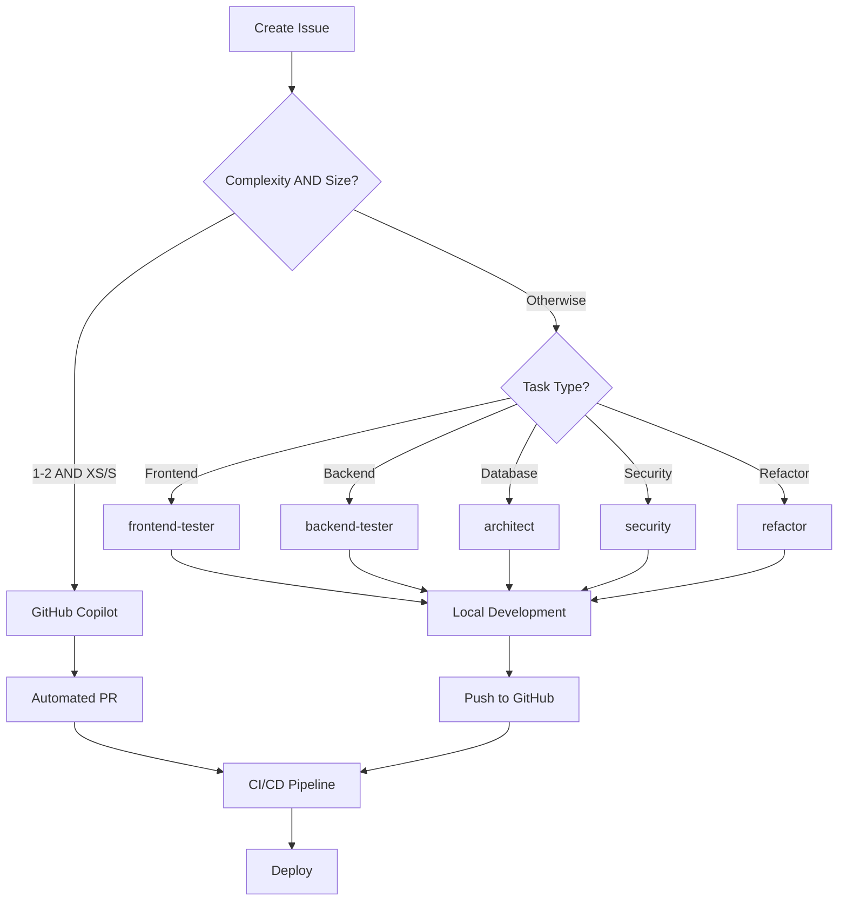

# Multi-Agent Development Framework Template

**A production-ready template** for building AI-powered applications with orchestrated agents, GitHub automation, and intelligent task routing.

## 🎯 What You Get

When you clone this template, you get a complete development system with:

- **🤖 7 Specialized AI Agents**: Each handling specific development tasks
- **🔄 15+ GitHub Workflows**: CI/CD, deployments, testing, project management
- **⚡ Slash Commands**: `/create-feature`, `/build-feature`, `/deploy` and more
- **📊 Intelligent Routing**: Tasks auto-assigned based on Complexity AND Size
- **🔧 Local + Cloud**: Local development with Claude Code, cloud automation with GitHub

## 🚀 Use This Template For

- **SaaS Applications**: Full-stack web apps with authentication and payments
- **API Services**: RESTful or GraphQL APIs with automatic documentation
- **E-commerce Platforms**: Online stores with inventory and checkout
- **Internal Tools**: Admin dashboards, data management systems
- **AI Applications**: Apps leveraging LLMs and intelligent features

## 🏗️ Architecture



## ⚡ Quick Start (3 Steps)

```bash
# 1. Use this template to create your repo
gh repo create my-app --template yourusername/multi-agent-claude-code --clone
cd my-app

# 2. Start Claude Code and configure
claude
/setup-project  # Interactive setup wizard

# 3. Create your first feature
/create-feature user-authentication
```

📖 **Full Guide**: [GETTING-STARTED.md](./GETTING-STARTED.md)

## 📁 What's Included

```
your-new-project/
├── .github/
│   ├── workflows/           # 15+ ready-to-use GitHub Actions
│   ├── COPILOT-WORKFLOW.md  # Agent routing rules
│   └── labels.yml           # Auto-label enforcement
├── .claude/
│   ├── commands/            # 6 slash commands ready to use
│   ├── hooks/              # 3 essential development hooks
│   ├── agents/             # 7 specialized agent configs
│   └── settings.json       # Pre-configured hook settings
├── docs/                   # Complete documentation
├── templates/              # GitHub issue/PR templates
└── CLAUDE.md              # AI behavior instructions
```

## 🤖 The Agent Team

| Agent | Specialization | When It's Used | Key Tools |
|-------|---------------|----------------|-----------|  
| **GitHub Copilot** | Simple tasks | Complexity 1-2 AND Size XS/S | GitHub API only |
| **frontend-tester** | UI & Testing | Frontend features, browser testing | Playwright, Vercel |
| **backend-tester** | APIs & Testing | Backend features, API testing | Postman, DigitalOcean |
| **refactor** | Code Quality | Refactoring, optimization | Multi-file editing |
| **architect** | System Design | Database, architecture | Supabase, diagrams |
| **security** | Authentication | Auth, security features | Auth providers |
| **integrations** | External Services | Webhooks, third-party APIs | Service SDKs |

## ✨ Key Features

### 🎯 Intelligent Agent Routing
```
Complexity 1-2 + Size XS/S → GitHub Copilot (autonomous)
Complexity 3-5 OR Size M/L/XL → Specialized Claude agents (local)
```

### ⚡ Ready-to-Use Commands
| Command | What It Does |
|---------|-------------|
| `/setup-project` | Interactive project configuration wizard |
| `/create-feature` | Creates GitHub issue → assigns agent → creates branch |
| `/build-feature` | Implements feature from issue using multiple agents |
| `/refactor` | Improves code quality across files |
| `/deploy` | Deploys to staging or production |
| `/test` | Runs appropriate test suites |

### 🔄 GitHub Automation (15+ Workflows)
- **On Push**: Linting, type checking, unit tests
- **On PR**: Integration tests, security scans, reviews
- **On Merge**: Auto-deploy to staging
- **On Release**: Production deployment
- **Project Board**: Auto-updates based on PR/issue status

## 🛠️ Supported Tech Stacks

### Frontend Options
- **Next.js** (default) → Vercel
- React, Vue, Svelte → Vercel/Netlify
- Static sites → GitHub Pages

### Backend Options  
- **Node.js/Express** (default) → DigitalOcean
- Python/FastAPI → DigitalOcean/Railway
- Go/Gin → DigitalOcean

### Database Options
- **PostgreSQL** (default) → Supabase
- MySQL → PlanetScale
- MongoDB → Atlas

### Authentication
- **Supabase Auth** (default)
- Clerk, Auth0, Firebase Auth

Configure your stack with `/setup-project`

## 📚 Documentation

| Document | Purpose |
|----------|---------|  
| [GETTING-STARTED.md](./GETTING-STARTED.md) | Step-by-step setup guide |
| [AGENT-SETUP.md](./AGENT-SETUP.md) | Agent capabilities and tools |
| [SECRETS-SETUP.md](./SECRETS-SETUP.md) | Required API keys and tokens |
| [COPILOT-WORKFLOW.md](./.github/COPILOT-WORKFLOW.md) | Agent routing rules |
| [CLAUDE.md](./CLAUDE.md) | AI assistant configuration |

## 🔐 Required Setup

### 1. GitHub Secrets (minimum required)
```bash
gh secret set ANTHROPIC_API_KEY        # For Claude agents
gh secret set SUPABASE_URL             # Database
gh secret set VERCEL_TOKEN             # Frontend deployment
gh secret set DIGITALOCEAN_ACCESS_TOKEN # Backend deployment
```

### 2. GitHub Apps
- **GitHub Copilot** - [Install](https://github.com/apps/copilot)
- **Claude Code** (optional) - [Install](https://github.com/apps/claude)

📖 Full setup: [SECRETS-SETUP.md](./SECRETS-SETUP.md)

## 🚀 Success Stories

> "Reduced our MVP development from 3 months to 3 weeks"
> — Startup Founder

> "The agent routing is genius - simple tasks are automated, complex ones get expert attention"
> — Senior Developer

> "Finally, a framework that actually delivers on AI-assisted development"
> — Tech Lead

## 💡 Why This Template?

### ⚡ Speed
- **10x faster** feature development
- **Automated** routine tasks
- **Parallel** agent execution

### 🎯 Quality
- **Built-in** testing at every step
- **Automated** code reviews
- **Consistent** coding standards

### 📈 Scale
- **MVP to Production** ready
- **Team-friendly** workflows
- **Enterprise** patterns included

## 🤝 Contributing

This template is actively maintained. Contribute improvements:

1. Fork the template
2. Add your enhancement
3. Test with a real project
4. Submit PR with examples

## 📝 License

MIT - Use freely for any project

---

### 🎯 Start Building in 3 Minutes

```bash
gh repo create my-app --template [this-repo] --clone && cd my-app && claude
```

Then run `/setup-project` and you're ready to build!

**Questions?** Check [GETTING-STARTED.md](./GETTING-STARTED.md) or open an issue.