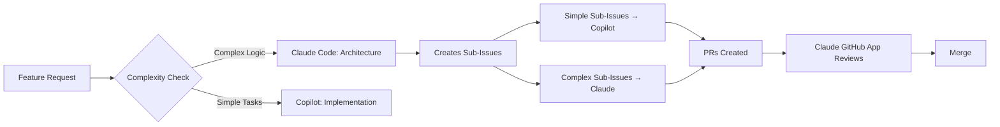

# Agent Routing Matrix

## Automatic Assignment Rules

### Tasks for GitHub Copilot (Auto-Assigned)
These get `copilot-ready` label and auto-assign:

| Task Type | Criteria | Example |
|-----------|----------|---------|
| **Bug Fixes** | `type/bug` + `complexity/S` or `complexity/M` | "Fix login button not working" |
| **Unit Tests** | `component/testing` + existing code | "Add unit tests for user service" |
| **Documentation** | `type/docs` + clear spec | "Update API documentation" |
| **Simple CRUD** | `component/backend` + `crud` keyword | "Add DELETE endpoint for users" |
| **UI Components** | `component/frontend` + existing pattern | "Add loading spinner to form" |
| **Linting/Formatting** | `type/refactor` + `cleanup` keyword | "Fix ESLint warnings" |

### Tasks for Claude Code (Local)
These stay with Claude for complex reasoning:

| Task Type | Criteria | Example |
|-----------|----------|---------|
| **Architecture** | `complexity/XL` or `component/architecture` | "Design microservices structure" |
| **Complex Features** | `complexity/L` or `complexity/XL` | "Implement real-time collaboration" |
| **Security** | `component/security` | "Add OAuth2 implementation" |
| **Database Design** | `component/database` + `schema` | "Design multi-tenant schema" |
| **Integration Planning** | Multiple `component/*` labels | "Connect payment + email + analytics" |
| **Performance** | `type/performance` | "Optimize query performance" |

### Tasks for Claude Code GitHub App
For review and coordination:

| Task Type | When Used |
|-----------|-----------|
| **PR Reviews** | All Copilot PRs automatically |
| **Merge Coordination** | Multiple PRs affecting same components |
| **Quality Gates** | Before merging to main |

## How It Works Automatically

### 1. Issue Creation
When you create an issue, add labels that trigger routing:
- Small bugs → Copilot handles
- Complex features → Claude handles
- Tests for existing code → Copilot handles
- New architecture → Claude handles

### 2. The Magic Labels

**Auto-Trigger Copilot:**
- `copilot-ready` - Manually indicate Copilot should handle
- `type/bug` + `complexity/S` - Small bugs
- `component/testing` - Test writing
- `type/docs` - Documentation updates

**Keep with Claude:**
- `needs-architecture` - Requires design decisions
- `complexity/XL` - Too complex for Copilot
- `blocking` - Infrastructure that blocks other work

### 3. Parallel Work Example



## Implementation Without Complexity

### Step 1: Label Your Issues Properly
```yaml
# Example issue labels for automatic routing:
- component/frontend
- complexity/S
- type/bug
→ Automatically assigned to Copilot

- component/backend
- complexity/XL
- type/feature
→ Stays with Claude Code
```

### Step 2: Let Automation Handle It
The workflow watches for labels and assigns automatically.
No manual intervention needed.

### Step 3: Review Process
1. Copilot creates PR
2. Claude Code GitHub App reviews (if installed)
3. You do final review
4. Merge

## When to Override

Sometimes you want manual control:
- Add `manual-assignment` label to prevent auto-assignment
- Explicitly assign to Copilot with `copilot-ready` label
- Use `/assign-copilot` command (when implemented)

## The Key: Clear Task Definition

For Copilot to work well, issues need:
1. Clear acceptance criteria (checklist)
2. Specific scope (one thing, not many)
3. Examples if relevant
4. Links to similar code

For Claude to work well, issues need:
1. Context about why
2. Flexibility in approach
3. Architectural considerations
4. Integration points