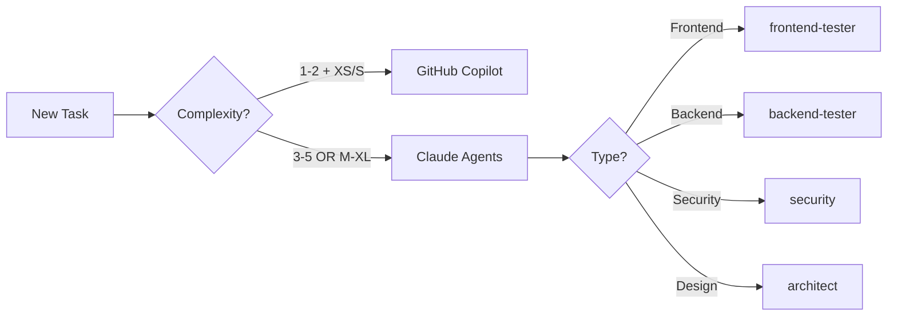

# Agent Orchestration Framework

> **Our Unique Approach**: GitHub-native automation with Copilot orchestration and Claude Code agents working in harmony through GitHub Actions workflows.

## 🎯 Core Philosophy

**"GitHub First, Automation Always"**

Unlike traditional agent frameworks, we leverage GitHub's native capabilities:
- **GitHub Copilot**: Handles simple tasks (Complexity 1-2 AND Size XS/S)
- **Claude Code Agents**: Tackle complex, multi-file challenges
- **GitHub Actions**: Orchestrates everything automatically
- **Project Board**: Single source of truth for all work

## 🤖 Agent Activation Patterns

### Context-Based Triggering
```yaml
Pattern Detection → Agent Activation → Workflow Automation

Examples:
- "auth" + "security" → security agent + backend-tester
- "UI" + "responsive" → frontend-tester + architect
- "API" + "third-party" → integrations + security
- "performance" + "slow" → refactor + backend-tester
```

### Complexity-Based Routing


## 🔄 Multi-Agent Coordination

### Sequential Patterns
```yaml
Feature Implementation Flow:
1. architect → Creates design
2. backend-tester → Implements API
3. frontend-tester → Builds UI
4. security → Validates implementation
5. pr-reviewer → Final review
```

### Parallel Patterns
```yaml
PR Review Flow (Parallel):
├── security → Security scan
├── frontend-tester → UI tests
├── backend-tester → API tests
└── pr-reviewer → Code review
    └── All complete → Merge
```

### Blocking Patterns
```yaml
Security Blocks All:
- Critical vulnerability found
- Exposed secrets detected
- Authentication bypass possible
→ All other agents halt
→ Human intervention required
```

## 📊 GitHub Integration Points

### 1. Issue Templates → Agent Assignment
```yaml
Issue Template:
  - Type: Task
  - Complexity: 3
  - Size: M
  - Component: Backend API
→ Automatically assigns: backend-tester
→ Creates workflow: test-and-validate.yml
```

### 2. Pull Requests → Automated Testing
```yaml
PR Created:
  - Files changed: *.tsx, *.css
  - Labels: frontend, needs-testing
→ Triggers: frontend-test-suite.yml
→ Assigns: frontend-tester
→ Posts: Test results as PR comment
```

### 3. GitHub Actions → Agent Orchestration
```yaml
name: Agent Orchestration
on:
  issues:
    types: [opened, labeled]
  pull_request:
    types: [opened, synchronize]

jobs:
  route-to-agent:
    steps:
      - name: Analyze Complexity
      - name: Assign Agent
      - name: Trigger Workflow
      - name: Update Project Board
```

## 🎭 Behavioral Modes

### 1. Development Mode
**Active Agents**: backend-tester, frontend-tester, refactor  
**GitHub Actions**: ci.yml, test.yml  
**Focus**: Writing and testing code

### 2. Review Mode
**Active Agents**: pr-reviewer, security  
**GitHub Actions**: review.yml, security-scan.yml  
**Focus**: Code quality and security validation

### 3. Architecture Mode
**Active Agents**: architect, integrations  
**GitHub Actions**: design-review.yml  
**Focus**: System design and planning

### 4. Emergency Mode
**Active Agents**: security, backend-tester  
**GitHub Actions**: hotfix.yml, security-patch.yml  
**Focus**: Critical fixes and vulnerability patches

## 🔗 MCP Server Integration

### Dynamic MCP Activation
```yaml
Context → MCP Server:
  - UI Development → playwright
  - Database Work → supabase
  - API Design → postman
  - Documentation → notion
  - Authentication → github
```

## 📈 Complexity Sizing Matrix

| Complexity | Size | Agent | Example |
|------------|------|-------|---------|
| 1-2 | XS-S | GitHub Copilot | Fix typo, add comment |
| 3 | S-M | Single Agent | Add validation to form |
| 4 | M-L | Multi-Agent | Implement auth flow |
| 5 | L-XL | All Agents | Refactor architecture |

## 🚀 Unique Advantages Over Other Frameworks

### vs SuperClaude
- ✅ **Native GitHub Integration**: We live in GitHub, not alongside it
- ✅ **Copilot Orchestration**: Leverages GitHub's AI for simple tasks
- ✅ **Workflow Automation**: Actions handle orchestration, not commands
- ✅ **Project Board Integration**: Visual task tracking built-in

### vs Generic Agent Frameworks
- ✅ **Zero Setup**: Works with existing GitHub workflows
- ✅ **Automatic Triggering**: No manual agent invocation needed
- ✅ **Built-in CI/CD**: Agents work within your deployment pipeline
- ✅ **Native PR Integration**: Comments, reviews, checks all automated

## 🎯 When to Use What

### Use GitHub Copilot When:
- Task is clearly defined and small
- Single file changes
- No complex logic required
- Complexity 1-2 AND Size XS/S

### Use Claude Agents When:
- Multi-file coordination needed
- Complex business logic
- Security implications
- Architecture decisions required

### Use Human Review When:
- Critical security issues
- Major architecture changes
- Breaking API changes
- Customer-facing critical paths

## 📋 Agent Roster

| Agent | Specialty | Triggers | GitHub Integration |
|-------|-----------|----------|-------------------|
| **frontend-tester** | UI/UX Testing | PR with *.tsx, *.jsx | Posts screenshots to PR |
| **backend-tester** | API Testing | PR with */api/*, *.py | Runs test suite |
| **architect** | System Design | Issue with 'design' label | Creates ADRs |
| **security** | Vulnerability Scan | Any auth changes | Blocks PR if critical |
| **refactor** | Code Improvement | 'tech-debt' label | Creates cleanup PRs |
| **integrations** | 3rd Party APIs | 'integration' label | Tests webhooks |
| **pr-reviewer** | Code Review | All PRs | Reviews and comments |

## 🔮 Future Enhancements

### Phase 1 (Now)
- ✅ 7 specialized agents
- ✅ GitHub Actions integration
- ✅ Copilot for simple tasks

### Phase 2 (Next)
- 🔄 Multi-agent coordination patterns
- 🔄 Advanced MCP server integration
- 🔄 Behavioral mode switching

### Phase 3 (Future)
- 📅 Self-organizing agent teams
- 📅 Learning from PR patterns
- 📅 Predictive agent activation

---

**Remember**: Our system's power comes from being GitHub-native, not from command complexity. We automate through workflows, not through manual commands. This is what makes us different and better for GitHub-based teams.