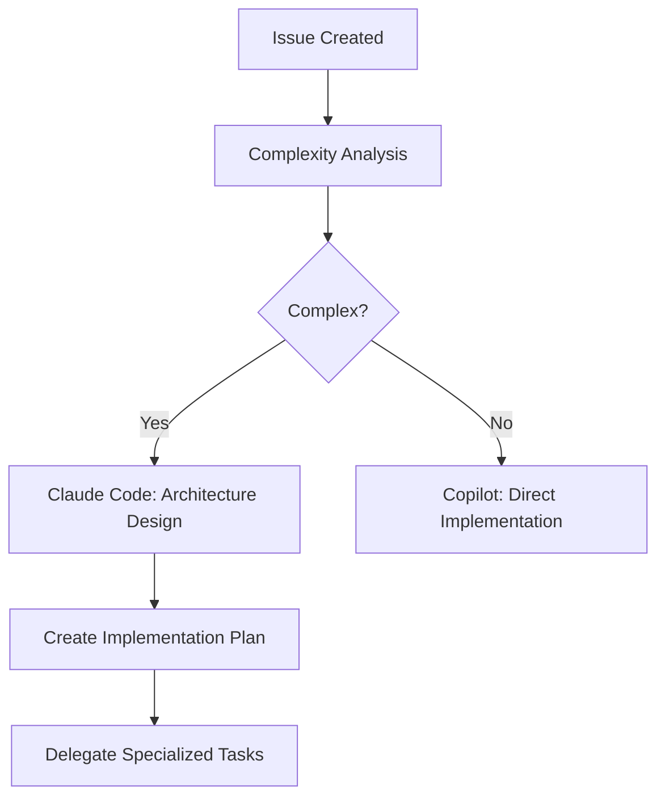

# AI Task Allocation - Multi-Agent Development Framework

## Agent Specialization Matrix

### Primary Agent Assignment Rules

#### GitHub Copilot (Simple Tasks)
**Criteria**: Complexity ≤2 AND Size ≤S  
**Strengths**: Fast execution, GitHub integration, unlimited usage with GitHub Pro

| Task Type | Examples | Typical Duration |
|-----------|----------|------------------|
| Bug Fixes | Fix typos, simple logic errors, missing imports | 15-30 minutes |
| Code Updates | Update dependencies, change configuration values | 10-20 minutes |
| Documentation | Update README, fix broken links, add comments | 20-45 minutes |
| Simple Features | Add basic validation, simple UI components | 30-60 minutes |

#### Claude Code (Complex Tasks)
**Criteria**: Complexity >2 OR Size >S  
**Strengths**: Full MCP access, multi-file coordination, architectural decisions

| Task Type | Examples | Typical Duration |
|-----------|----------|------------------|
| Architecture | System design, major refactoring, new integrations | 2-8 hours |
| Complex Features | Authentication systems, API design, data models | 1-4 hours |
| Multi-file Changes | Framework updates, dependency changes, migrations | 1-3 hours |
| Problem Solving | Debugging complex issues, performance optimization | 1-6 hours |

### Specialized MCP Server Allocation

#### Together AI MCP Server
**Free Tier**: 3000 requests/month  
**Specialization**: Complex code generation and algorithm implementation

```typescript
interface TogetherAITasks {
  codeGeneration: {
    algorithms: string[];      // Complex algorithms, data structures
    systemDesign: string[];    // Architecture patterns, design patterns
    optimization: string[];    // Performance-critical code
    integration: string[];     // Complex API integrations
  };
  
  languages: string[];         // Python, JavaScript, TypeScript, Go, Rust
  complexity: 'high';          // Multi-step logic, advanced patterns
  usagePattern: 'batch';       // Fewer, more complex requests
}
```

**Ideal Tasks**:
- Advanced algorithm implementations
- Complex business logic
- System architecture code generation
- Performance-critical optimizations
- Multi-step code transformations

**Usage Commands**:
```bash
# Complex algorithm generation
/mcp together generate-algorithm --type "graph-traversal" --language python

# System component generation
/mcp together generate-component --type "authentication-service" --framework fastapi

# Code optimization
/mcp together optimize-code --file src/performance.js --focus "memory-usage"
```

#### Gemini 1.5 Pro MCP Server
**Free Tier**: 1500 requests/day  
**Specialization**: Testing, documentation, and code analysis

```typescript
interface GeminiTasks {
  testing: {
    unitTests: string[];       // Comprehensive test coverage
    integrationTests: string[]; // API and workflow testing
    e2eTests: string[];        // Complete user journey testing
    testData: string[];        // Realistic test fixtures
  };
  
  documentation: {
    apiDocs: string[];         // API reference documentation
    userGuides: string[];      // How-to guides and tutorials
    codeComments: string[];    // Inline code documentation
    specifications: string[];  // Technical specifications
  };
  
  analysis: {
    codeReview: string[];      // Code quality assessment
    security: string[];        // Security vulnerability analysis
    performance: string[];     // Performance bottleneck identification
  };
}
```

**Ideal Tasks**:
- Comprehensive test suite generation
- API documentation creation
- Code review and analysis
- Security vulnerability assessment
- User guide and tutorial writing

**Usage Commands**:
```bash
# Test generation
/mcp gemini generate-tests --source src/auth.js --coverage 90

# Documentation generation
/mcp gemini generate-docs --source src/api/ --format openapi

# Code analysis
/mcp gemini analyze-code --file src/security.js --focus vulnerabilities
```

#### HuggingFace Inference MCP Server
**Free Tier**: 30,000 characters/month  
**Specialization**: Specialized model access and domain-specific tasks

```typescript
interface HuggingFaceTasks {
  specializedModels: {
    sqlcoder: string[];        // SQL query generation and optimization
    wizardcoder: string[];     // Code completion and suggestions
    starcoder: string[];       // Multi-language code generation
    codellama: string[];       // Code explanation and refactoring
  };
  
  domainSpecific: {
    nlp: string[];             // Text processing and analysis
    dataScience: string[];     // Data analysis and ML code
    webdev: string[];          // Frontend and web-specific code
    devops: string[];          // Infrastructure and deployment code
  };
}
```

**Ideal Tasks**:
- SQL query generation and optimization
- Domain-specific code patterns
- Specialized framework code (React, Vue, Django)
- Data science and ML implementations
- DevOps and infrastructure code

**Usage Commands**:
```bash
# SQL generation
/mcp huggingface generate-sql --description "user analytics report" --database postgresql

# Specialized code generation
/mcp huggingface generate-component --framework react --type "data-visualization"

# Domain-specific patterns
/mcp huggingface generate-pattern --domain "data-science" --task "data-preprocessing"
```

## Workflow Patterns

### 1. Feature Development Workflow

#### Phase 1: Planning & Architecture (Claude Code)


#### Phase 2: Specialized Implementation
```bash
# Architecture & complex logic → Claude Code
/work feature/user-authentication

# Code generation → Together AI
/mcp together generate-auth-service --framework fastapi --features "jwt,oauth,2fa"

# Test generation → Gemini
/mcp gemini generate-tests --source src/auth/ --types "unit,integration,e2e"

# Documentation → Gemini  
/mcp gemini generate-docs --source src/auth/ --audience "developers,users"

# Simple updates → Copilot (automatic via GitHub)
```

#### Phase 3: Integration & Quality (Claude Code)
```bash
# Review generated code
/review generated-code --source all --quality-gates

# Integration testing
/test integration --scope auth-system

# Security validation
/mcp gemini analyze-security --source src/auth/ --standards owasp
```

### 2. Bug Fix Workflow

#### Simple Bugs (Copilot)
```bash
# Automatic assignment for simple issues
Criteria: Single file, clear cause, < 30 minutes
Examples: Typos, import errors, configuration updates
```

#### Complex Bugs (Claude Code + MCP Servers)
```bash
# Investigation & root cause analysis
/debug issue --id 123 --analyze-full-context

# Code analysis for insights
/mcp gemini analyze-code --file src/problematic.js --focus "potential-bugs"

# Generate comprehensive tests to reproduce
/mcp gemini generate-reproduction-tests --bug-description "..."

# Implement fix with Together AI if complex
/mcp together fix-algorithm --issue "performance-bottleneck" --context full
```

### 3. Documentation Workflow

#### Automatic Documentation Generation
```bash
# API documentation (Gemini)
/mcp gemini generate-api-docs --source src/api/ --format openapi

# User guides (Gemini)
/mcp gemini generate-user-guide --feature authentication --audience end-users

# Code comments (Gemini)
/mcp gemini add-comments --source src/complex-algorithm.js --style comprehensive

# Architecture diagrams (Claude Code)
/diagram-generate --type system-architecture --format mermaid
```

## Resource Optimization Strategies

### Free Tier Management

#### Usage Tracking
```typescript
interface UsageTracker {
  togetherAI: {
    used: number;           // Current month usage
    limit: 3000;           // Monthly limit
    resetDate: Date;       // Next reset
    priority: 'complex-generation';
  };
  
  gemini: {
    used: number;          // Current day usage
    limit: 1500;          // Daily limit
    resetTime: Date;       // Next reset (daily)
    priority: 'testing-docs';
  };
  
  huggingface: {
    used: number;          // Current month character count
    limit: 30000;         // Monthly character limit
    resetDate: Date;       // Next reset
    priority: 'specialized-models';
  };
}
```

#### Fallback Chain Strategy
```bash
# Primary: Free tier models
/mcp gemini generate-tests --source src/auth.js

# Fallback 1: Alternative free model
if [ $? -ne 0 ]; then
  /mcp huggingface generate-tests --model codellama --source src/auth.js
fi

# Fallback 2: Claude Code direct implementation
if [ $? -ne 0 ]; then
  /test-generate --source src/auth.js --method manual
fi

# Fallback 3: Copilot for simple cases
if [ complexity -le 2 ]; then
  # Assign to @copilot via GitHub issue
  gh issue create --assignee copilot --title "Generate tests for src/auth.js"
fi
```

### Smart Task Routing

#### Request Optimization
```typescript
interface TaskRouter {
  analyzeTask(description: string): TaskAnalysis;
  selectOptimalAgent(analysis: TaskAnalysis): AgentSelection;
  
  // Batch similar requests to minimize API calls
  batchSimilarTasks(tasks: Task[]): BatchedRequest[];
  
  // Use context efficiently across requests
  reuseContext(projectContext: ProjectContext): ContextCacheStrategy;
}

// Example routing logic
function routeTask(task: string): AgentAssignment {
  const analysis = analyzeComplexity(task);
  
  if (analysis.isSimple && analysis.isSmall) {
    return { agent: 'copilot', rationale: 'Simple task, free execution' };
  }
  
  if (analysis.requiresCodeGeneration && analysis.isComplex) {
    return { 
      agent: 'together-ai', 
      rationale: 'Complex code generation, high-quality model needed',
      fallback: 'claude-code'
    };
  }
  
  if (analysis.isTestingOrDocs) {
    return { 
      agent: 'gemini', 
      rationale: 'Specialized in testing and documentation',
      fallback: 'claude-code'
    };
  }
  
  return { agent: 'claude-code', rationale: 'Default for complex coordination' };
}
```

### Performance Optimization

#### Context Sharing Efficiency
```typescript
// Cache project context to avoid repeated reads
class ContextManager {
  private static cache: Map<string, ProjectContext> = new Map();
  private static lastUpdate: Map<string, Date> = new Map();
  
  static async getContext(projectPath: string): Promise<ProjectContext> {
    const cacheKey = projectPath;
    const lastMod = await this.getLastModified(`${projectPath}/PROJECT_CONTEXT.md`);
    
    if (!this.cache.has(cacheKey) || this.lastUpdate.get(cacheKey)! < lastMod) {
      const context = await this.loadContext(projectPath);
      this.cache.set(cacheKey, context);
      this.lastUpdate.set(cacheKey, new Date());
    }
    
    return this.cache.get(cacheKey)!;
  }
}
```

#### Batch Processing
```typescript
// Batch similar requests to reduce API overhead
class BatchProcessor {
  private pendingRequests: Map<string, PendingRequest[]> = new Map();
  
  async addRequest(type: string, request: Request): Promise<Response> {
    if (!this.pendingRequests.has(type)) {
      this.pendingRequests.set(type, []);
      
      // Process batch after small delay
      setTimeout(() => this.processBatch(type), 100);
    }
    
    return new Promise((resolve, reject) => {
      this.pendingRequests.get(type)!.push({ request, resolve, reject });
    });
  }
  
  private async processBatch(type: string): Promise<void> {
    const requests = this.pendingRequests.get(type) || [];
    this.pendingRequests.delete(type);
    
    if (requests.length === 0) return;
    
    try {
      const batchResponse = await this.makeBatchAPICall(type, requests);
      this.distributeBatchResults(requests, batchResponse);
    } catch (error) {
      requests.forEach(req => req.reject(error));
    }
  }
}
```

## Quality Assurance Patterns

### Multi-Agent Quality Gates
```bash
# Phase 1: Generation
/mcp together generate-feature --name user-profile --complexity high

# Phase 2: Testing (different agent)
/mcp gemini generate-tests --source generated/user-profile.js --coverage 95

# Phase 3: Documentation (same agent, different task)
/mcp gemini generate-docs --source generated/user-profile.js --audience api-users

# Phase 4: Review (Claude Code coordination)
/review-integration --sources generated/ --quality-gates security,performance,maintainability

# Phase 5: Security Analysis
/mcp gemini analyze-security --source generated/ --standards "owasp,nist"
```

### Cross-Validation
```typescript
// Validate generated code using multiple agents
interface QualityValidation {
  // Generate with Together AI
  code: string;
  
  // Validate with Gemini
  testCoverage: number;
  securityIssues: SecurityIssue[];
  performanceProfile: PerformanceMetrics;
  
  // Final review with Claude Code
  integrationCheck: boolean;
  architectureCompliance: boolean;
  qualityScore: number;
}
```

This allocation strategy ensures optimal use of each AI agent's strengths while maintaining cost efficiency through free tier maximization and intelligent fallback patterns.