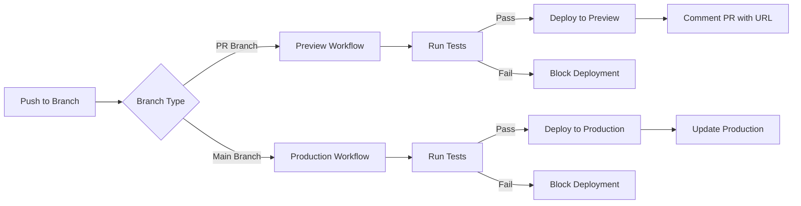

# CI/CD Setup Guide

## Overview

This project uses GitHub Actions + Vercel for automated deployments with separate workflows for preview and production environments.

## Deployment Flow



## Workflows

### 1. Preview Deployment (`preview-deployment.yml`)

**Triggers**: 
- Pull request opened
- Pull request updated

**Process**:
1. Run all tests (Node.js/Python if present)
2. Run linting and type checking
3. Deploy to Vercel preview environment
4. Comment on PR with preview URL

**Environment**: Preview (isolated per PR)

### 2. Production Deployment (`production-deployment.yml`)

**Triggers**:
- Push to main branch
- Manual workflow dispatch

**Process**:
1. Run all tests (MUST pass)
2. Run linting and type checking (MUST pass)
3. Build production artifacts
4. Deploy to Vercel production
5. Create GitHub deployment record

**Environment**: Production (live site)

## Required Secrets

Add these to your GitHub repository settings:

```bash
VERCEL_TOKEN        # Get from: https://vercel.com/account/tokens
VERCEL_ORG_ID       # Get from: vercel project settings
VERCEL_PROJECT_ID   # Get from: vercel project settings
```

### How to Get Vercel Secrets

1. **VERCEL_TOKEN**:
   ```bash
   # Go to https://vercel.com/account/tokens
   # Create new token with name "GitHub Actions"
   ```

2. **VERCEL_ORG_ID & PROJECT_ID**:
   ```bash
   # In your project directory:
   vercel link
   
   # Then check .vercel/project.json:
   cat .vercel/project.json
   ```

3. **Add to GitHub**:
   ```bash
   gh secret set VERCEL_TOKEN --body "your-token-here"
   gh secret set VERCEL_ORG_ID --body "your-org-id"
   gh secret set VERCEL_PROJECT_ID --body "your-project-id"
   ```

## Test Requirements

### Node.js Projects

Your `package.json` must have these scripts:

```json
{
  "scripts": {
    "test": "jest",
    "lint": "eslint .",
    "typecheck": "tsc --noEmit",
    "build": "next build"
  }
}
```

### Python Projects

Your project must have:
- `requirements.txt` with test dependencies
- Tests discoverable by `pytest`

## What Gets Deployed

### ✅ Deployed to Vercel
- Application code (`src/`, `pages/`, `app/`)
- API routes (`api/`)
- Static assets (`public/`)
- Configuration files (`package.json`, `vercel.json`)

### ❌ NOT Deployed
- Framework files (`.claude/`, `.github/`)
- Documentation (`docs/`, `*.md`)
- Templates (`templates/`)
- Test files (`__tests__/`, `*.test.js`)

## Manual Deployment

You can still deploy manually:

```bash
# Preview deployment
vercel

# Production deployment
vercel --prod

# Or use the slash command
/deploy
```

## Environments

### Preview Environment
- Created for each PR
- Isolated from production
- Automatic URL generation
- Deleted when PR is closed

### Production Environment
- Single production instance
- Only deploys from main branch
- Tests MUST pass
- Creates deployment record

## Monitoring Deployments

### GitHub UI
- Check Actions tab for workflow status
- View Deployments in repo sidebar
- PR comments show preview URLs

### Vercel Dashboard
- https://vercel.com/dashboard
- Shows all deployments
- View logs and metrics

## Troubleshooting

### Tests Failing
```bash
# Run tests locally first
npm test
npm run lint
npm run typecheck
```

### Deployment Failing
```bash
# Check Vercel configuration
vercel pull
vercel build
```

### Missing Secrets
```bash
# Verify secrets are set
gh secret list
```

## Best Practices

1. **Always test locally** before pushing
2. **Keep tests fast** (< 5 minutes total)
3. **Use preview deployments** to verify changes
4. **Never skip tests** in production
5. **Monitor deployment status** in GitHub Actions

## Rollback Procedure

If production deployment causes issues:

```bash
# 1. Revert the commit
git revert HEAD
git push origin main

# 2. Or use Vercel dashboard
# Go to Vercel > Project > Deployments
# Click "..." on previous deployment
# Select "Promote to Production"
```

## Summary

- **Preview**: Automatic on PR, tests run but non-blocking
- **Production**: Automatic on merge, tests MUST pass
- **Manual**: Always available via CLI or `/deploy`
- **Rollback**: Easy via git revert or Vercel dashboard