# CI/CD & Testing Guide

## Overview

Our CI/CD pipeline integrates automated deployments with comprehensive testing at every stage. Tests must pass before code deploys.

## Three-Layer Testing Architecture

### 1. 🤖 Automated CI/CD Layer
**When**: Every push and PR
**Where**: GitHub Actions (`.github/workflows/`)
**What**:
- ✅ Syntax validation (ESLint, ruff)
- ✅ Type checking (TypeScript, mypy)
- ✅ Unit tests (Jest, pytest)
- ✅ Security scanning
- ✅ Build verification

### 2. 🌐 Frontend Testing Layer
**When**: Frontend changes detected
**Agent**: `frontend-playwright-tester`
**What**:
- ✅ Real browser testing with Playwright
- ✅ User flow validation
- ✅ Form submissions and validation
- ✅ Responsive design (mobile/tablet/desktop)
- ✅ Visual regression testing
- ✅ Accessibility checks
- ✅ Cross-browser compatibility

### 3. 🔧 Backend Testing Layer
**When**: Backend/API changes detected
**Agent**: `backend-tester`
**What**:
- ✅ API endpoint testing
- ✅ Database operations
- ✅ Authentication/authorization flows
- ✅ Integration tests
- ✅ Performance benchmarks
- ✅ Error handling validation

## Deployment Flow

```mermaid
graph TD
    A[Code Change] --> B{Type?}
    B -->|PR| C[Preview Workflow]
    B -->|Main| D[Production Workflow]
    
    C --> E[Run Tests]
    D --> F[Run Tests]
    
    E -->|Pass| G[Deploy Preview]
    E -->|Fail| H[❌ Block]
    
    F -->|Pass| I[Deploy Production]
    F -->|Fail| J[❌ Block]
    
    G --> K[Comment PR URL]
    I --> L[Live Site Updated]
```



## Workflows

### Preview Deployment (`preview-deployment.yml`)
- **Triggers**: PR opened/updated
- **Tests**: Must pass
- **Deploy**: Vercel preview environment
- **Result**: Comment on PR with URL

### Production Deployment (`production-deployment.yml`)
- **Triggers**: Push to main
- **Tests**: MUST pass (no exceptions)
- **Deploy**: Vercel production
- **Result**: Live site updated

## Testing Commands

### Local Testing
```bash
# Frontend tests with Playwright
/work --test-frontend

# Backend API tests
/work --test-backend

# All tests
/work --test

# Manual Playwright session
npx playwright test
```

### CI/CD Testing (Automatic)
```bash
# Runs automatically on:
- Every push
- Every PR
- Before deployments
```

## Required Setup

### 1. GitHub Secrets
```bash
VERCEL_TOKEN        # From: https://vercel.com/account/tokens
VERCEL_ORG_ID       # From: vercel project settings
VERCEL_PROJECT_ID   # From: vercel project settings
```

### 2. Package Scripts
```json
{
  "scripts": {
    "test": "jest",
    "test:e2e": "playwright test",
    "lint": "eslint .",
    "typecheck": "tsc --noEmit",
    "build": "next build"
  }
}
```

### 3. Test Structure
```
tests/
├── unit/           # Jest unit tests
├── integration/    # API integration tests
├── e2e/           # Playwright E2E tests
└── fixtures/      # Test data
```

## What Gets Deployed vs Tested

### 🚀 Deployed to Vercel
- `src/`, `pages/`, `app/` - Application code
- `api/` - API routes
- `public/` - Static assets
- `package.json`, `vercel.json` - Config

### 🧪 Tested but NOT Deployed
- `.claude/` - AI framework
- `.github/` - Workflows
- `docs/` - Documentation
- `tests/` - Test files
- `*.md` - Markdown files

## Testing Strategy by Change Type

### Frontend Changes
1. Unit tests run (Jest/Vitest)
2. Playwright E2E tests run
3. Visual regression checks
4. Deploy preview if pass

### Backend Changes
1. Unit tests run (pytest/Jest)
2. Integration tests run
3. API endpoint tests
4. Deploy if pass

### Documentation Changes
- No tests required
- No deployment triggered
- Direct merge allowed

## Manual Testing Checklist

Before marking PR complete:
- [ ] Run unit tests locally
- [ ] Test critical user flows
- [ ] Check responsive design
- [ ] Verify API endpoints
- [ ] Test error scenarios
- [ ] Check performance

## Rollback Procedures

### Quick Rollback
```bash
# Via Git
git revert HEAD
git push origin main

# Via Vercel Dashboard
# 1. Go to Deployments
# 2. Find previous working version
# 3. Click "Promote to Production"
```

## Monitoring

### Check Status
- **GitHub Actions**: Actions tab
- **Vercel Dashboard**: vercel.com/dashboard
- **Logs**: Available in both

### Common Issues

**Tests Failing?**
```bash
# Debug locally first
npm test
npm run lint
npm run typecheck
```

**Deployment Failing?**
```bash
# Check Vercel config
vercel pull
vercel build --debug
```

**Playwright Issues?**
```bash
# Install browsers
npx playwright install
# Run headed mode
npx playwright test --headed
```

## Best Practices

1. **Test Locally First**: Always run tests before pushing
2. **Keep Tests Fast**: < 5 minutes total runtime
3. **Use Preview URLs**: Test in preview before production
4. **Write Tests with Changes**: New feature = new tests
5. **Monitor Deployments**: Watch GitHub Actions for status

## Summary

- **CI/CD**: Automated testing + deployment pipeline
- **Testing**: Three layers (CI, Frontend, Backend)
- **Preview**: Every PR gets tested preview
- **Production**: Only deploys if ALL tests pass
- **Agents**: Specialized testers for complex scenarios