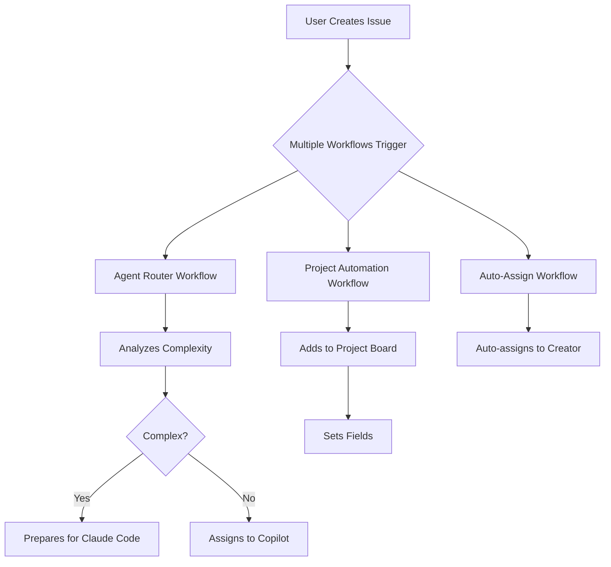
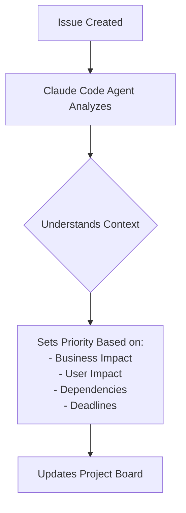
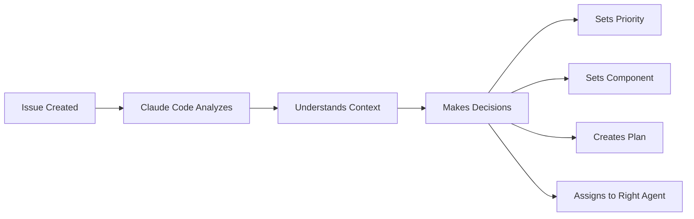

# Complete GitHub Automation Workflow Explanation

## Overview
This document explains exactly how our GitHub automation works, who makes decisions, and what happens at each step.

## Current Workflow Architecture

### 1. When an Issue is Created



### 2. Active Workflows

We currently have these workflows running:

1. **agent-router.yml** - Decides which AI agent should handle the issue
2. **project-automation.yml** - Adds issues to project board and sets fields
3. **auto-assign.yml** - Assigns issues to their creators
4. **issue-to-implementation.yml** - Creates branches and implementation plan
5. **ci.yml** - Runs tests on PRs
6. **full-pipeline.yml** - Complete CI/CD pipeline with gates

## WHO Makes Priority Decisions? (Current State)

### The Problem You Identified
Currently, priority is set by **dumb pattern matching** in the workflow:

```javascript
// This is in project-automation.yml
if (labels.some(l => l.name === 'critical' || l.name === 'urgent')) {
  priorityId = process.env.PRIORITY_P0;
} else if (labels.some(l => l.name === 'high-priority')) {
  priorityId = process.env.PRIORITY_P1;
} else {
  priorityId = process.env.PRIORITY_P3; // Default to P3
}
```

**This is NOT intelligent!** It just looks for keywords.

### What SHOULD Happen (Proposed)



## Complete Flow: Issue → Implementation → Deployment

### Step 1: Issue Creation
- **Trigger**: User creates issue with title and description
- **Example**: "[BUG] Login button not working on mobile"

### Step 2: Workflows Fire (In Parallel)
All these happen simultaneously:

#### A. Agent Router (`agent-router.yml`)
```yaml
Purpose: Decide which AI should handle this
Logic:
  - Counts lines in issue body
  - If > 50 lines OR has "complex" label → Claude Code
  - If simple → GitHub Copilot
  - Creates comment saying which agent to use
```

#### B. Project Automation (`project-automation.yml`)
```yaml
Purpose: Add to project board and set fields
Current Logic (DUMB):
  - Priority: Based on labels/title keywords
  - Component: Based on labels/body text
  - Status: Always starts as "Todo"
  
Uses: PROJECT_TOKEN (your GitHub token with project scope)
```

#### C. Auto-Assign (`auto-assign.yml`)
```yaml
Purpose: Assign issue to creator
Logic: Simple - assigns to whoever created it
```

#### D. Branch Creation (part of multiple workflows)
```yaml
Purpose: Create development branch
Format: {type}/{issue-number}-{title}
Example: bug/15-login-button-mobile
```

### Step 3: Development Phase

#### Manual Process (Current)
1. Developer checks out branch
2. Makes changes
3. Commits and pushes
4. Creates PR

#### With Claude Code Agent (Proposed)
```bash
# Agent would:
1. Check out branch automatically
2. Analyze codebase
3. Implement fix
4. Run tests
5. Create PR
```

### Step 4: PR Review & Testing

#### When PR is Created
- **CI Pipeline** (`ci.yml`) runs:
  - Unit tests
  - Integration tests
  - Linting
  - Type checking

- **Full Pipeline** (`full-pipeline.yml`) has gates:
  ```yaml
  Quality Gates → Test Gates → Security Gates → Deploy
  (If ANY fail, deployment stops)
  ```

### Step 5: Deployment

#### Staging Deployment
- Automatic on PR approval
- Deploys to staging environment

#### Production Deployment
- Requires manual approval
- Only after all gates pass

## Current Problems & Solutions

### Problem 1: Priority Decision
**Current**: Dumb keyword matching
**Solution**: Have Claude Code analyze and set priority intelligently

### Problem 2: Multiple Workflows Compete
**Current**: All workflows fire at once, sometimes conflict
**Solution**: Consolidate or coordinate workflows

### Problem 3: Component Detection
**Current**: Looks for keywords in labels/body
**Solution**: Claude Code should analyze code changes to determine component

## How to Test the Complete Flow

1. **Create Test Issue**:
```bash
gh issue create --title "[BUG] Test issue" \
  --body "This is a test" \
  --label "type:bug"
```

2. **Watch Workflows**:
```bash
gh run list --limit 5
```

3. **Check Project Board**:
```bash
gh api graphql -f query='
  query {
    user(login: "vanman2024") {
      projectV2(number: 11) {
        items(first: 1) {
          nodes {
            content { ... on Issue { number title } }
            fieldValues { nodes { 
              ... on ProjectV2ItemFieldSingleSelectValue {
                name
                field { ... on ProjectV2SingleSelectField { name } }
              }
            }}
          }
        }
      }
    }
  }'
```

## Environment Secrets Required

1. **PROJECT_TOKEN**: Your GitHub token with `project` scope
   - Used to: Access and modify project boards
   - Set via: `gh auth token | gh secret set PROJECT_TOKEN`

2. **GITHUB_TOKEN**: Provided by GitHub Actions
   - Used to: Basic repo operations
   - Limitation: Cannot access user projects

## Proposed Intelligent Workflow

Instead of dumb automation, we should have:



### Implementation Plan for Intelligent Priority

1. **Add Claude Code Hook**:
```yaml
- name: Analyze Issue with Claude
  run: |
    claude-code analyze-issue \
      --issue-number ${{ github.event.issue.number }} \
      --set-priority \
      --set-component \
      --create-plan
```

2. **Claude Would Consider**:
- Is this blocking users?
- Does this affect revenue?
- Are there dependencies waiting?
- What's the effort vs impact?
- Are there deadlines mentioned?

3. **Then Set Priority Based on Understanding**:
- P0: Critical/blocking/security issues
- P1: High impact, affecting many users
- P2: Important but not urgent
- P3: Nice to have, low impact

## Quick Reference Commands

### Check Current Workflows
```bash
ls .github/workflows/
```

### See Recent Runs
```bash
gh run list --limit 10
```

### Check Project Board
```bash
# Open in browser
gh project view 11 --owner vanman2024 --web
```

### Test Workflow
```bash
# Create test issue
gh issue create --title "Test" --body "Test"

# Watch workflows
watch gh run list --limit 5
```

## Next Steps

1. [ ] Implement Claude Code analysis for priority setting
2. [ ] Consolidate competing workflows
3. [ ] Add Start/End date automation
4. [ ] Create intelligent component detection
5. [ ] Build sub-agent coordination system