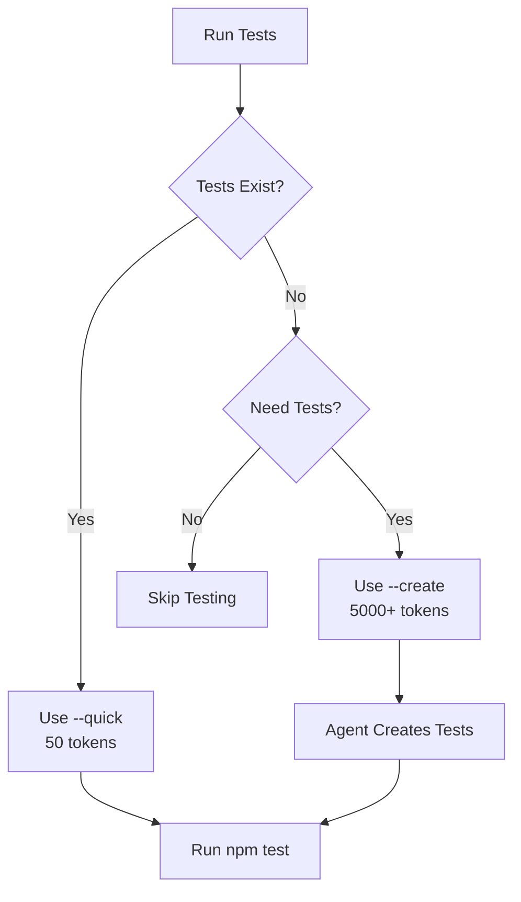

# Token-Efficient Testing Strategy

## Problem
Running `/test` was using 5000+ tokens every time by invoking agents to create/run tests, even when tests already existed.

## Solution
The `/test` command now checks for existing tests first and only uses agents when necessary.

## Token Usage by Command

| Command | Token Usage | When to Use |
|---------|------------|-------------|
| `/test --quick` | ~50-100 tokens | Default - runs existing tests |
| `/test` (no flags) | ~50-100 tokens | Auto-detects, uses --quick if tests exist |
| `/test --create` | ~5000+ tokens | Only when creating NEW test files |
| `/test --update` | ~2000+ tokens | Only when updating existing tests |
| `/test --ci` | ~20 tokens | Triggers GitHub Actions (free) |

## Recommended Workflow

### 1. Daily Development (Cheap)
```bash
# Just run existing tests locally
/test --quick              # ~50 tokens
# OR
npm test                   # 0 tokens (direct command)
```

### 2. On Pull Requests (Free)
```bash
# GitHub Actions runs automatically
# No tokens used - it's free!
git push                   # Triggers CI/CD
```

### 3. Creating New Tests (Expensive - Use Sparingly)
```bash
# Only when you need NEW test files
/test --create --backend   # ~5000+ tokens

# Better: Write tests manually or use GitHub Copilot
```

### 4. CI/CD Pipeline (Free)
```bash
# Trigger GitHub Actions
/test --ci                 # ~20 tokens (just triggers)
# OR
gh workflow run ci-cd-pipeline.yml  # Direct command
```

## Cost Comparison

### Before (Wasteful)
- Every `/test` command: 5000+ tokens
- 10 test runs/day: 50,000 tokens
- Monthly: 1.5 million tokens 💸

### After (Efficient)
- Quick test runs: 50 tokens
- 10 test runs/day: 500 tokens  
- Monthly: 15,000 tokens ✅
- **100x reduction in token usage!**

## Decision Tree



## Best Practices

### ✅ DO
- Run `npm test` directly when possible (0 tokens)
- Use GitHub Actions for PR validation (free)
- Use `--quick` flag for local testing (minimal tokens)
- Let Copilot suggest simple test additions (free with Pro)

### ❌ DON'T
- Use `/test --create` repeatedly (wasteful)
- Run agents when tests already exist (unnecessary)
- Create tests for every small change (expensive)
- Use Claude for simple unit tests (overkill)

## When to Use Each Tool

| Scenario | Tool | Cost |
|----------|------|------|
| Run existing tests | `npm test` or `/test --quick` | Free/Minimal |
| PR validation | GitHub Actions | Free |
| Simple test additions | GitHub Copilot | Free with Pro |
| Complex test creation | `/test --create` | High (use sparingly) |
| Test debugging | Claude Code | Moderate |
| Routine testing | GitHub Actions CI | Free |

## Implementation Details

The `/test` command now:
1. **Checks for existing tests first** (before using any agents)
2. **Uses --quick mode by default** when tests exist
3. **Warns about token usage** before using agents
4. **Requires explicit flags** for expensive operations

## Example Usage

```bash
# First time - create tests (expensive but necessary)
/test --create --backend    # Creates test files

# Every time after - run existing tests (cheap)
/test --quick               # Just runs npm test
# OR better:
npm test                    # Direct command, no tokens

# On PR push
git push                    # GitHub Actions runs tests for free
```

## Summary

- **Default behavior changed**: Now checks for existing tests first
- **Token usage reduced**: 100x reduction for routine testing
- **Explicit flags required**: Must use --create to invoke agents
- **GitHub Actions preferred**: Free testing on every push
- **Manual testing encouraged**: npm test uses 0 tokens

This strategy ensures we only use expensive agent operations when absolutely necessary, while routine testing remains fast and cheap.