# GitHub Workflows Guide - What Each One Does

## 🟢 WORKING WORKFLOWS

### 1. `auto-assign.yml` ✅ WORKING
**Trigger:** When issues are opened  
**What it does:**
- Auto-assigns issue to creator
- Adds labels based on title keywords ([BUG], [FEATURE])
- Previously created branches (removed to avoid duplicates)

### 2. `issue-to-implementation.yml` ✅ WORKING  
**Trigger:** When issues are opened or commented on
**What it does:**
- Creates development branch (bug/123-title)
- Adds labels based on issue content
- Creates sub-tasks for features
- Responds to slash commands (/implement, /assign-copilot)

### 3. `project-board-v2.yml` 🟡 PARTIALLY WORKING
**Trigger:** Issues/PRs opened, closed
**What it does:**
- Uses GitHub's official action to add items to project
- Auto-labels based on content
- Updates status labels
**Problem:** Needs GitHub App token for project access

## 🔴 NOT WORKING / NEEDS FIXES

### 4. `project-automation.yml` ❌ BROKEN
**Trigger:** Issues/PRs/comments
**What it does:** Was supposed to update project board fields
**Problem:** GraphQL query errors, permission issues
**Status:** Being replaced by project-board-v2.yml

### 5. `claude.yml` & `claude-code-review.yml` ❌ NOT CONFIGURED
**Trigger:** PR comments with /review
**What it does:** Would trigger Claude to review code
**Problem:** Needs Claude API setup

## 🚀 DEPLOYMENT WORKFLOWS

### 6. `ci.yml` - Basic CI/CD
**Trigger:** Push to main/develop, PRs
**What it does:**
```
1. Lint → Format → Test → Build → Deploy
   ↓ FAIL = STOP
```
- Basic sequential pipeline
- Some steps allowed to fail (continue-on-error)
- NOT strict about gates

### 7. `full-pipeline.yml` - STRICT Pipeline ⭐ RECOMMENDED
**Trigger:** PRs and pushes to main
**What it does:**
```
Quality Gates → Test Gates → Security → Build → Staging → Approval → Production
     ↓              ↓            ↓         ↓        ↓          ↓
   STOP           STOP         STOP      STOP     STOP       STOP
```
- **NOTHING deploys if ANY test fails**
- Requires manual approval for production
- Has rollback capability
- **This is the one we should use!**

### 8. `deploy-frontend.yml` - Vercel Deployment
**Trigger:** Push to main, manual
**What it does:**
- Deploys frontend to Vercel
- Creates preview for PRs
- Production deploy for main branch
**Needs:** VERCEL_TOKEN secret

### 9. `deploy-backend.yml` - DigitalOcean Deployment  
**Trigger:** Push to main, manual
**What it does:**
- Deploys backend to DigitalOcean
- Supports Docker/App Platform/Droplets
**Needs:** DIGITALOCEAN_ACCESS_TOKEN secret

### 10. `api-testing.yml` - API Tests with Postman
**Trigger:** After deployment, manual
**What it does:**
- Runs Postman collection tests
- Tests staging/production APIs
- Webhook testing
**Needs:** Newman installed

## 🤖 AUTOMATION WORKFLOWS

### 11. `agent-router.yml` - Routes Issues to AI
**Trigger:** Issues labeled/opened
**What it does:**
- Analyzes issue complexity
- Routes to Copilot (simple) or Claude (complex)
- Adds appropriate labels

### 12. `scheduled-tasks.yml` - Maintenance
**Trigger:** Daily at 2 AM UTC
**What it does:**
- Closes stale issues
- Updates dependencies
- Runs security audits

## Which Should We Use?

### For Development:
1. **Keep:** `auto-assign.yml` - Works well
2. **Keep:** `issue-to-implementation.yml` - Creates branches
3. **Fix:** `project-board-v2.yml` - Needs token
4. **Delete:** `project-automation.yml` - Broken, replaced

### For CI/CD:
1. **USE:** `full-pipeline.yml` - Most complete with gates
2. **Delete:** `ci.yml` - Less strict, redundant
3. **Configure:** `deploy-frontend.yml` - After adding Vercel token
4. **Configure:** `deploy-backend.yml` - After adding DO token

### For Automation:
1. **Keep:** `agent-router.yml` - Good for AI routing
2. **Configure:** `scheduled-tasks.yml` - Useful for maintenance

## The Main Pipeline Flow

```mermaid
graph LR
    Issue[Issue Created] --> Branch[Branch Created]
    Branch --> Dev[Development]
    Dev --> PR[Pull Request]
    PR --> Pipeline[full-pipeline.yml]
    Pipeline --> Quality[Quality Gates]
    Quality -->|Pass| Tests[Test Gates]
    Quality -->|Fail| Stop1[❌ STOP]
    Tests -->|Pass| Security[Security Gates]
    Tests -->|Fail| Stop2[❌ STOP]
    Security -->|Pass| Build[Build]
    Security -->|Fail| Stop3[❌ STOP]
    Build --> Staging[Deploy Staging]
    Staging --> Approval[Manual Approval]
    Approval --> Production[Deploy Production]
```



## Quick Fixes Needed

1. **Project Board:** Need GitHub App token
2. **Deployments:** Need Vercel & DigitalOcean tokens
3. **Cleanup:** Remove duplicate workflows
4. **Focus:** Use `full-pipeline.yml` as main CI/CD

## Environment Secrets Needed

```yaml
Required:
- GITHUB_TOKEN (automatic)

Need to add:
- VERCEL_TOKEN
- DIGITALOCEAN_ACCESS_TOKEN
- POSTMAN_API_KEY (optional)
- APP_ID (for project board)
- APP_PRIVATE_KEY (for project board)
```