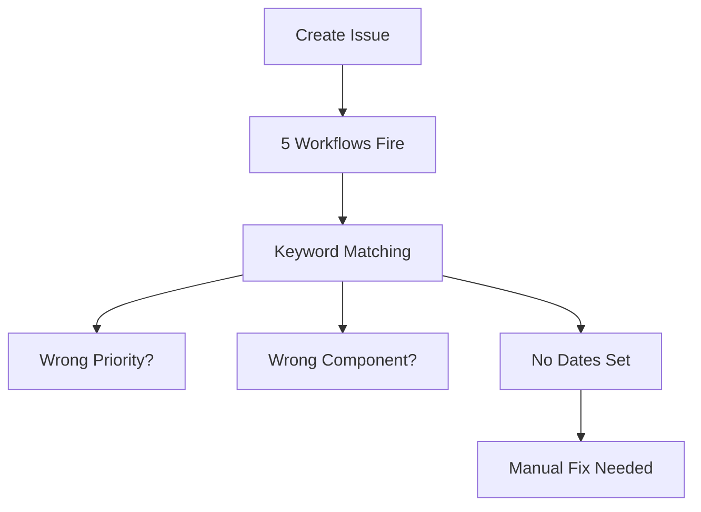

# Simple Workflow Explanation

## Current State: DUMB Automation 🤖

When you create an issue:

```
Issue: "Fix critical security bug in login"
                    ↓
         [DUMB WORKFLOW LOOKS FOR KEYWORDS]
                    ↓
    Sees word "critical" → Sets Priority: P0
    No "frontend" word → Component: Unknown ❌
                    ↓
         [RESULT: Wrong categorization]
```

## The Problem

The workflow is making decisions like this:

```javascript
// This is NOT intelligent - just pattern matching!

if (title.includes("critical")) {
    priority = "P0";  // <- Dumb decision!
}

// What if the issue said:
// "This is NOT critical, but..."
// It would still mark as P0! 🤦
```

## What's Actually Happening Now

1. **You create issue** → 5 different workflows all fire at once
2. **Agent Router** says: "Use Claude for this"
3. **Project Automation** says: "I'll add to board" (but uses dumb logic)
4. **Auto-Assign** says: "I'll assign to creator"
5. **Branch Creator** says: "I'll make a branch"

They're all working independently, not coordinating!

## What SHOULD Happen: Smart Automation 🧠

```
Issue: "Fix critical security bug in login"
                    ↓
            [CLAUDE CODE READS IT]
                    ↓
    Understands: "Security bug" + "login" = HIGH RISK
    Analyzes: This affects authentication
    Checks: Other auth issues in backlog
                    ↓
    INTELLIGENT DECISIONS:
    - Priority: P0 (understands security impact)
    - Component: Backend (knows login = backend API)
    - Estimate: 5 points (knows auth is complex)
    - Start Date: Today (urgent)
    - Assigns to: Security specialist
```

## Who's Making Decisions?

### Currently ❌
- **GitHub Workflow**: Dumb keyword matching
- **No Intelligence**: Just if/else statements
- **No Context**: Doesn't understand the issue

### Should Be ✅
- **Claude Code**: Reads and understands the issue
- **Intelligent**: Knows what "security bug" means
- **Context Aware**: Checks related issues, understands impact

## The Complete Flow (Current)



## Example: Why Current System Fails

### Issue Title: "Not critical: Update logo color"
- Workflow sees: "critical" 
- Sets: P0 🚨
- Reality: P3 (low priority)

### Issue Title: "Users can't pay - checkout broken"
- Workflow sees: No priority keywords
- Sets: P3 📉
- Reality: P0 (revenue critical!)

## The Solution

Instead of workflows making decisions, Claude Code should:

1. **Read** the issue completely
2. **Understand** the business impact
3. **Check** related issues and context
4. **Decide** priority intelligently
5. **Set** all fields correctly
6. **Explain** its reasoning

## Commands to See This Yourself

```bash
# Look at the dumb logic:
cat .github/workflows/project-automation.yml | grep -A 10 "Check labels for priority"

# See what happens to an issue:
gh issue create --title "Not critical: test" --body "Test"
# Watch it get marked as P0 because of "critical" word!

# Check the project board:
gh project item-list 11 --owner vanman2024 --limit 5
```

## The Real Problem

**The workflow can't tell the difference between:**
- "This is critical" vs "This is not critical"
- "Breaks login" vs "Changes login button color"
- "Affects all users" vs "Affects one user"

**Only AI can understand context!**