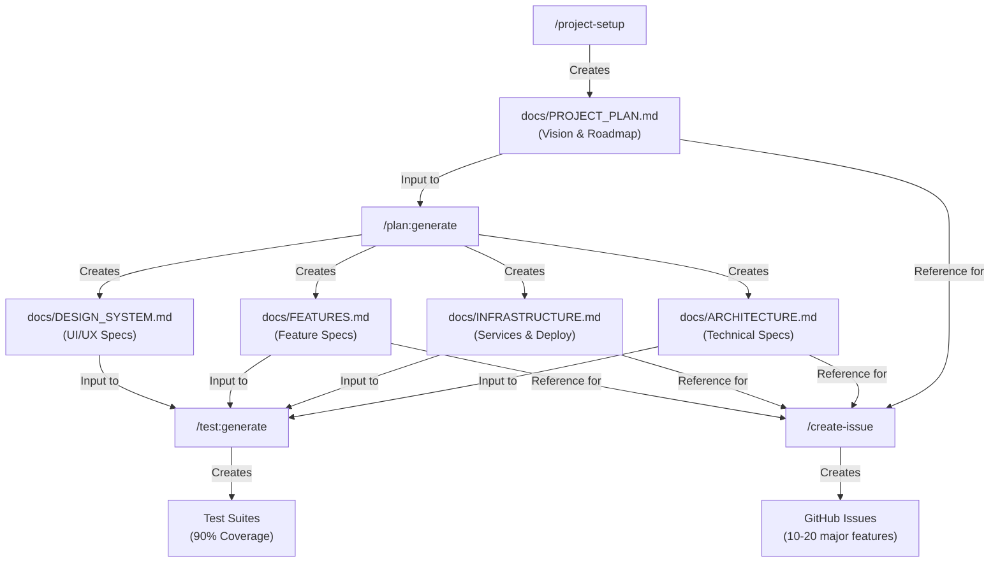

# Document Generation Flow

## Complete Development Workflow



## Document Purpose & Content

### 1. PROJECT_PLAN.md (Created by `/project-setup`)
**Purpose**: High-level vision document - the "north star"
**Contains**:
- Executive summary (what and why)
- Technology stack decisions
- Target users and their problems
- Core features (high-level)
- Unique value proposition
- Business model
- Implementation roadmap (4 phases)
- Success metrics

**NOT**:
- Detailed technical specifications
- Exhaustive feature lists
- Implementation details
- Task breakdowns

### 2. ARCHITECTURE.md (Created by `/plan:generate`)
**Purpose**: Detailed technical architecture
**Contains**:
- System architecture diagrams
- Detailed tech stack configurations
- API design patterns
- Database schema and relationships
- Authentication and authorization flows
- State management approach
- Security architecture
- Performance strategies
- Error handling patterns

### 3. INFRASTRUCTURE.md (Created by `/plan:generate`)
**Purpose**: Services and deployment specifications
**Contains**:
- Detailed service configurations
- Environment variables list
- CI/CD pipeline setup
- Monitoring and logging setup
- Cost breakdown per service
- Scaling strategies
- Backup and disaster recovery
- Security configurations

### 4. FEATURES.md (Created by `/plan:generate`)
**Purpose**: Detailed feature specifications
**Contains**:
- Complete user stories
- Detailed acceptance criteria
- User journey maps
- Business rules and validations
- Data flow diagrams
- Edge cases and error states
- Integration points
- Priority and dependencies

### 5. DESIGN_SYSTEM.md (Created by `/plan:generate`)
**Purpose**: UI/UX specifications (optional for API-only)
**Contains**:
- Component library structure
- Design tokens and variables
- Typography and color systems
- Spacing and layout grids
- Interaction patterns
- Accessibility requirements
- Responsive breakpoints

## Command Workflow

### Step 1: Discovery & Vision (`/project-setup`)
```bash
/project-setup
```
**Inputs**: User conversation about their project
**Outputs**: 
- `docs/PROJECT_PLAN.md` - The vision document
- GitHub repository (if requested)
- Project board setup
- Basic folder structure

### Step 2: Detailed Documentation (`/plan:generate`)
```bash
/plan:generate
```
**Inputs**: `docs/PROJECT_PLAN.md`
**Outputs**:
- `docs/ARCHITECTURE.md`
- `docs/INFRASTRUCTURE.md`
- `docs/FEATURES.md`
- `docs/DESIGN_SYSTEM.md` (if UI exists)

### Step 3: Test Generation (`/test:generate`)
```bash
/test:generate --all
```
**Inputs**: All documentation files
**Outputs**:
- Unit test files
- Integration test files (Postman collections)
- E2E test files
- Test configuration
- Mock infrastructure

### Step 4: Issue Creation (`/create-issue`)
```bash
/create-issue "User authentication"
```
**Inputs**: Feature specs from documentation
**Outputs**: GitHub issues (10-20 major features)

### Step 5: Implementation (`/work`)
```bash
/work #123
```
**Inputs**: GitHub issue
**Outputs**: Implementation with tests

## Key Principles

### Vision First, Details Second
1. **PROJECT_PLAN.md** defines WHAT we're building and WHY
2. Detailed docs define HOW we're building it
3. Tests verify we built it RIGHT
4. Issues track the WORK to build it

### Document Hierarchy
```
PROJECT_PLAN.md (Vision)
    ├── ARCHITECTURE.md (How - Technical)
    ├── INFRASTRUCTURE.md (Where - Deployment)
    ├── FEATURES.md (What - Specifications)
    └── DESIGN_SYSTEM.md (Look - UI/UX)
```

### Not Everything Becomes an Issue
- **Infrastructure setup**: Local checklist work
- **Architecture decisions**: Documentation only
- **Design system setup**: Local implementation
- **Standard features**: Grouped into larger issues
- **Custom features**: Individual issues (10-20 total)

## Common Misconceptions

### ❌ WRONG: Create 70+ issues for every task
✅ RIGHT: Create 10-20 feature issues, do infrastructure locally

### ❌ WRONG: PROJECT_PLAN.md contains detailed tasks
✅ RIGHT: PROJECT_PLAN.md is high-level vision only

### ❌ WRONG: Start with detailed documentation
✅ RIGHT: Start with vision, then generate details

### ❌ WRONG: /project-setup creates all documentation
✅ RIGHT: /project-setup creates vision, /plan:generate creates details

## Quick Reference

| Command | Creates | From |
|---------|---------|------|
| `/project-setup` | PROJECT_PLAN.md | User conversation |
| `/plan:generate` | ARCHITECTURE.md<br/>INFRASTRUCTURE.md<br/>FEATURES.md<br/>DESIGN_SYSTEM.md | PROJECT_PLAN.md |
| `/test:generate` | Test suites | All docs |
| `/create-issue` | GitHub issues | FEATURES.md |

## Example Flow

```bash
# 1. Create the vision
/project-setup
# Interactive conversation → creates PROJECT_PLAN.md

# 2. Generate detailed docs
/plan:generate
# Reads PROJECT_PLAN.md → creates 4 detailed docs

# 3. Generate tests
/test:generate --all
# Reads all docs → creates comprehensive tests

# 4. Create work items
/create-issue "User authentication system"
/create-issue "Payment processing"
/create-issue "Admin dashboard"
# Creates 10-20 major feature issues

# 5. Start building
/work #1
# Implements with tests
```

## Remember

- **Vision drives everything** - PROJECT_PLAN.md is your north star
- **Details support vision** - Technical docs expand on the plan
- **Not all work needs issues** - Infrastructure is local work
- **10-20 issues total** - Group related work together
- **Tests from day one** - 90% coverage before coding