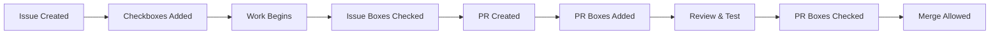

# Checkbox Enforcement Strategy

## Overview
We use checkboxes to track task completion at both Issue and PR levels. This ensures work is properly completed before moving to the next stage.

## Where Checkboxes Appear

### 1. GitHub Issues
**Purpose**: Track implementation tasks before coding starts
**Location**: Issue body
**Example**:
```markdown
## Implementation Tasks
- [ ] Design database schema
- [ ] Create API endpoints  
- [ ] Write unit tests
- [ ] Update documentation
```

**Enforcement**: 
- Issues can be created with unchecked boxes (planning phase)
- `/work` command checks if prerequisite boxes are checked
- Can't create PR until issue tasks are done

### 2. Pull Requests
**Purpose**: Track review and merge requirements
**Location**: PR description
**Example**:
```markdown
## Required Checks
- [ ] All tests pass
- [ ] Code reviewed
- [ ] Documentation updated
- [ ] No breaking changes
```

**Enforcement**:
- PR can be created with unchecked boxes
- **CANNOT MERGE** until all required boxes checked
- Enforced by `pr-checklist-required.yml` workflow
- Requires branch protection to be enabled

### 3. Local Development (TodoWrite)
**Purpose**: Track work in Claude Code
**Location**: Claude's TodoWrite tool
**Syncs to**: PR checkboxes automatically

## Workflow Stages



## Implementation

### Active Workflow
- **File**: `.github/workflows/pr-checklist-required.yml`
- **Action**: Uses `mheap/require-checklist-action@v2`
- **Triggers**: PR events, issue events, comments
- **Result**: Creates failing check if boxes unchecked

### Disabled Workflow
- **File**: `.github/workflows/pr-checkbox-enforcer.yml.disabled`
- **Reason**: Custom implementation, kept for reference
- **Status**: Disabled in favor of simpler action

### Branch Protection Requirements

**MUST BE SET MANUALLY**:
1. Go to Settings → Branches
2. Add rule for `main`
3. Enable "Require status checks to pass"
4. Add "Require All Checkboxes" as required
5. Save changes

Without branch protection, the workflow runs but DOESN'T block merging!

## Checkbox Rules

### Required vs Optional
- Required checkboxes: Must be checked before merge
- Optional checkboxes: Mark with `(optional)` in text
- Example:
  ```markdown
  - [ ] Must be done
  - [ ] Nice to have (optional)
  ```

### Auto-Generation
- Issues: Templates include standard checkboxes
- PRs: `/create-issue` command adds checkboxes
- TodoWrite: Syncs to PR checkboxes via hooks

## Common Issues

### Problem: PR merged with unchecked boxes
**Cause**: Branch protection not enabled
**Fix**: Enable branch protection with required status checks

### Problem: Checkbox workflow not running
**Cause**: Workflow file disabled or errored
**Fix**: Check `.github/workflows/pr-checklist-required.yml`

### Problem: Checkboxes not syncing
**Cause**: Hooks not configured or CLAUDE_PROJECT_DIR not set
**Fix**: Set environment variable and reload hooks

## Best Practices

1. **Issues**: Add implementation checkboxes when creating
2. **PRs**: Add review/merge checkboxes in description
3. **Updates**: Check boxes as work progresses
4. **Reviews**: Reviewers verify boxes are accurate
5. **Automation**: Let TodoWrite sync with PR boxes

## Testing

To test checkbox enforcement:
1. Create PR with unchecked boxes
2. Verify "Require All Checkboxes" check fails
3. Check a box and update PR
4. Verify check re-runs
5. Check all boxes
6. Verify check passes and merge allowed